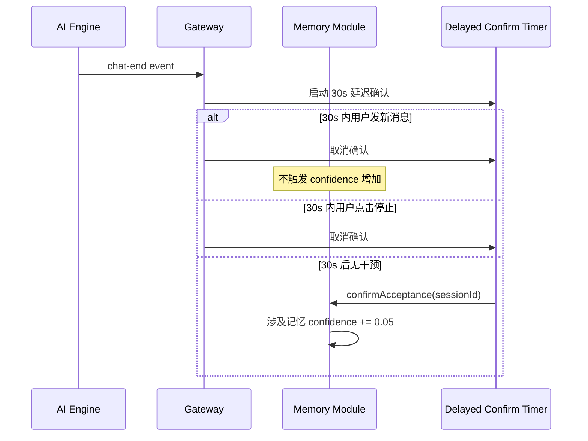

# banto 记忆系统升级方案 - 核心机制详细设计（附录）

> **关联主文档**：[memory-system-upgrade-design.md](./memory-system-upgrade-design.md)
> **创建日期**：2026-05-28
> **状态**：待评审
> **用途**：回答用户对主方案 4 个核心机制的质疑

---

## 附录 A：反馈闭环详细设计

### A.1 信号捕获埋点位置

| 信号类型 | 埋点位置 | 触发条件 | 代码位置 |
|---------|---------|---------|---------|
| **用户立即纠正** | Gateway 入站处理 | 用户消息与上一轮 AI 输出语义冲突 | `modules/gateway/inbound-handler.ts` 新增 `detectContradiction()` |
| **用户接受不反对** | Session 完成钩子 | `chat-end` 后 30s 内无新消息 + 无 `stop` 操作 | `ai-engine/session/manager.ts` `handleChatEnd()` 延迟确认 |
| **任务验证失败** | 工具执行后置钩子 | `execute_command` exit code ≠ 0 | `ai-engine/tool/handlers/runtime.ts` 执行后回调 |
| **记忆被引用** | Prompt 注入时 | `getMemoryPrompt()` 记录每条记忆的注入次数 | `ai-engine/memory/index.ts` 新增 `trackInjection()` |
| **Skill 评估反馈** | Skill 评估完成 | `SkillEvaluationReport` 分数 ≥ 4.0 | `modules/skill/evaluator.ts` 回调 memory 模块 |

### A.2 Confidence 计算公式

**初始值**：

| 来源 | 初始 confidence | 说明 |
|------|----------------|------|
| AI 工具 `memory_save` | AI 自评（0.6 - 0.9） | AI 在工具参数中提供 |
| Extractor 自动提取 | 固定 0.7 | 阈值线（低于 0.7 不写入） |
| 用户手动创建 | 固定 1.0 | 最高信任 |

**增减规则**：

| 事件 | 变化量 | 公式 | 累积效应 |
|------|--------|------|---------|
| 用户立即纠正 | -0.2 | `max(0.1, confidence - 0.2)` | 5 次纠正 → 归档 |
| 用户接受不反对 | +0.05 | `min(1.0, confidence + 0.05)` | 20 次确认 → 满分 |
| 任务验证失败 | -0.15 | `max(0.1, confidence - 0.15)` | 7 次失败 → 归档 |
| 被引用但无负反馈 | +0.02 | `min(1.0, confidence + 0.02)` | 50 次引用 → 满分 |
| Skill 评估高分（≥4.0） | +0.1 | `min(1.0, confidence + 0.1)` | 10 次高分 → 满分 |

**设计原则**：

1. **负信号权重 > 正信号**：避免错误记忆长期存活（-0.2 vs +0.05）
2. **显式信号 > 隐式信号**：用户纠正（-0.2）> 任务失败（-0.15）> 引用无反馈（+0.02）
3. **快速降级，缓慢升级**：5 次纠正可归档，但需 20 次确认才满分

### A.3 晋升条件判定逻辑

**feedback → 候选 Skill 晋升条件**：

```typescript
interface PromotionCriteria {
  minConfidence: 0.85;           // 置信度阈值
  minReferenceCount: 3;          // 最少引用次数
  observationDays: 7;            // 观察期（天）
  noNegativeFeedback: true;      // 观察期内无负反馈
}
```

**引用次数统计**：

- 每次 `getMemoryPrompt()` 注入时，写入 `~/.iflymate/memory/_injection_log.jsonl`
- 格式：`{"memoryName": "use-real-db", "sessionId": "xxx", "timestamp": "2026-05-28T10:30:00Z"}`
- 统计时按 `memoryName` 分组计数

### A.4 "用户不反对"判定逻辑

**判定条件**（需同时满足）：

1. Session 状态为 `completed`（非 `stopped` / `error`）
2. 最后一条 AI 消息后 **30 秒**内无新用户消息
3. 用户未点击「停止」按钮
4. 任务验证通过（如有 `execute_command` 调用）

**实现时序**：



### A.5 误判风险防护

| 误判场景 | 防护措施 |
|---------|---------|
| 用户沉默 ≠ 认可 | confidence 增量小（+0.05），需多次确认才晋升 |
| 任务失败但记忆无关 | 仅惩罚被引用的 feedback 类记忆，user/project 不受影响 |
| 用户纠正但表述模糊 | 关键词匹配（"不"、"错了"、"不对"）+ 上下文窗口综合判断 |
| 时间衰减误杀常用记忆 | `lastUsedAt` 字段在每次注入时更新，常用记忆不衰减 |

---

## 附录 B：用前校验规则详细设计

### B.1 触发条件与匹配规则

| 记忆内容特征 | 正则匹配规则 | 校验方法 | 示例 |
|------------|------------|---------|------|
| **文件路径** | `/[\/\\][\w\-\.\/\\]+\.(ts\|js\|vue\|md\|json)/g` | `fs.access()` 检查存在性 | "修改 `src/utils/helper.ts` 时..." |
| **IPC Channel** | `/'[a-z\-]+:[a-z\-]+'/g` | 与 `preload.ts` 注册表对照 | "调用 `project:create`" |
| **函数/类名** | `/\b[A-Z][a-zA-Z0-9]+\(/g` | GitNexus 符号查询或 `grep -r` | "使用 `validateInput()` 函数" |
| **Skill ID** | `/skill-[\w\-]+/g` | 与 `~/.iflymate/skills/_registry.json` 对照 | "启用 skill-code-review" |
| **Expert ID** | `/expert-[\w\-]+/g` | 与 `~/.iflymate/experts/_registry.json` 对照 | "切换到 expert-backend" |
| **MCP Server** | `/@[\w\-]+\/[\w\-]+/g` | 与 `mcp_config.json` 对照 | "使用 @iflywork/feishu-channel" |

**不触发校验的内容**（白名单）：

- 用户偏好描述（"喜欢用 Prettier"、"习惯用 Tailwind"）
- 抽象概念（"遵循 DRY 原则"）
- 外部系统指针（"Linear 项目 INGEST"）
- 时间约束（"下周冻结合并"）

### B.2 校验失败判定标准

| 校验类型 | 失败条件 | 严重等级 | 处理策略 |
|---------|---------|---------|---------|
| **文件不存在** | `fs.access()` 抛出 ENOENT | 🔴 HIGH | 降级（× 0.5）+ 标记 `staleHint: "文件已删除"` |
| **符号找不到** | GitNexus 无结果 + grep 无匹配 | 🟡 MEDIUM | 降级（× 0.7）+ 标记 `staleHint: "符号未找到"` |
| **注册表不匹配** | Skill/Expert/MCP ID 不在注册表 | 🔴 HIGH | 降级（× 0.5）+ 标记 `staleHint: "已卸载"` |
| **版本不匹配** | package.json 版本号差异 > 1 major | 🟡 MEDIUM | 警告但不降级，标记 `staleHint: "版本已升级"` |

**降级策略**：

- 连续 **3 次** stale → 自动归档至 `~/.iflymate/memory/_archive/`
- 归档后不再注入，但保留文件供用户查看

### B.3 误判防护机制

**场景 1：用户偏好被误判为文件路径**

```typescript
// 防护：路径必须包含目录分隔符 + 文件扩展名
function isLikelyFilePath(text: string): boolean {
  const hasPathSeparator = /[\/\\]/.test(text);
  const hasExtension = /\.\w{2,4}$/.test(text);
  return hasPathSeparator && hasExtension;
}

// 示例：
// "喜欢用 Prettier" → false（无路径分隔符）
// "src/utils/helper.ts" → true（有路径 + 扩展名）
```

**场景 2：抽象概念被误判为函数名**

```typescript
// 防护：函数名必须紧跟括号，且在代码块或反引号内
function isLikelyFunctionName(text: string, context: string): boolean {
  const inCodeBlock = /`[^`]+`/.test(context);
  const hasParentheses = /\w+\(/.test(text);
  return inCodeBlock && hasParentheses;
}
```

### B.4 校验频率策略

| 策略 | 触发时机 | 适用场景 | 性能开销 |
|------|---------|---------|---------|
| **实时校验** | 每次 `getMemoryPrompt()` 注入前 | 高风险记忆（文件路径、符号名） | 高（+50-100ms） |
| **延迟校验** | 注入后异步执行，结果缓存 5 分钟 | 中风险记忆（Skill/Expert ID） | 低（不阻塞注入） |
| **定期批量** | 每日凌晨 3 点全量扫描 | 低风险记忆（版本号） | 无（后台任务） |

**推荐策略**：混合模式 — 高风险实时校验 + 中低风险延迟校验 + 每日批量兜底

---

## 附录 C：Confidence 打分机制详细设计

### C.1 初始值分配规则

| 来源 | 初始 confidence | 计算依据 |
|------|----------------|---------|
| AI 工具 `memory_save` | AI 自评（0.6 - 0.9） | AI 在工具参数中提供 |
| Extractor 自动提取 | 固定 0.7 | 阈值线（低于 0.7 不写入） |
| 用户手动创建 | 固定 1.0 | 最高信任 |
| 从 Skill 降级 | 继承 Skill 评分 × 0.8 | Skill 被禁用后转为 feedback 记忆 |

**AI 自评约束**（在 system prompt 中强制）：

- **0.9**：用户明确陈述的事实（"我是后端工程师"）
- **0.8**：用户纠正后的规则（"不要用 mock 数据库"）
- **0.7**：用户安静确认的判断（"对，这样更好"）
- **0.6**：你观察到的模式，但未经用户确认

### C.2 阈值边界与状态转换

| Confidence 区间 | 状态 | 行为 | 晋升/归档条件 |
|----------------|------|------|-------------|
| **[0.85, 1.0]** | 🟢 高置信 | L1 必读层，优先注入 | ≥ 0.85 + 引用 ≥ 3 次 → 候选 Skill |
| **[0.7, 0.85)** | 🟡 中置信 | L2 任务相关层，按需注入 | 正常使用，观察反馈 |
| **[0.5, 0.7)** | 🟠 低置信 | L3 按需检索层，仅工具调用 | 连续 5 次引用无负反馈 → 升至 0.7 |
| **[0.3, 0.5)** | 🔴 存疑 | 标记"待验证"，注入时附警告 | 连续 2 次正反馈 → 升至 0.5 |
| **[0.1, 0.3)** | ⚫ 待归档 | 不再注入，等待归档 | 7 天内无引用 → 自动归档 |

### C.3 时间衰减公式（可选，M3 后期启用）

```typescript
// 超过 30 天未被引用的记忆，每 7 天衰减一次
function applyTimeDecay(memory: MemoryEntry): number {
  const daysSinceLastUse = (Date.now() - new Date(memory.lastUsedAt || memory.updatedAt).getTime()) / (1000 * 60 * 60 * 24);
  
  if (daysSinceLastUse < 30) return memory.confidence;
  
  const decayRounds = Math.floor((daysSinceLastUse - 30) / 7);
  const decayFactor = Math.pow(0.95, decayRounds); // 每轮衰减 5%
  
  return Math.max(0.1, memory.confidence * decayFactor);
}
```

**衰减防护**：

- `lastUsedAt` 字段在每次注入时更新
- 常用记忆（每月引用 ≥ 1 次）不衰减

---

## 附录 D：结构化图谱方案评估

### D.1 方案对比

| 维度 | 方案 A：纯 Markdown | 方案 B：JSON + Markdown 双存 | 方案 C：纯 JSON + 渲染层 |
|------|-------------------|---------------------------|----------------------|
| **存储格式** | `.md` 文件 + frontmatter | `.json` 数据 + `.md` 渲染缓存 | `.json` 数据，按需渲染 |
| **查询性能** | 低（需解析 frontmatter） | 高（直接查 JSON） | 高（直接查 JSON） |
| **多维度索引** | 难（需全文扫描） | 易（JSON 字段索引） | 易（JSON 字段索引） |
| **关系图谱** | 难（需解析 `[[name]]`） | 易（JSON 存 `links` 数组） | 易（JSON 存 `links` 数组） |
| **人类可读性** | 高（直接打开 .md） | 中（需查看 .md 缓存） | 低（需工具渲染） |
| **向后兼容** | 完全兼容 | 需迁移脚本 | 需迁移脚本 |
| **实现复杂度** | 低（当前方案） | 中（双写逻辑） | 高（完全重构） |

### D.2 推荐方案：B（JSON + Markdown 双存）

**理由**：

1. **查询性能**：JSON 支持按 `type` / `confidence` / `updatedAt` / `引用次数` 快速过滤
2. **关系图谱**：JSON 存储 `links: string[]`，可快速构建记忆关系图
3. **人类可读**：保留 `.md` 文件供用户直接查看，不破坏现有体验
4. **渐进迁移**：现有 Markdown 记忆可通过脚本一次性转换为 JSON

### D.3 数据结构设计

**JSON 格式**（`~/.iflymate/memory/_index.json`）：

```json
{
  "version": "0.5.0",
  "memories": [
    {
      "name": "use-real-db-in-tests",
      "type": "feedback",
      "scope": "global",
      "description": "集成测试必须连真实数据库，不许 mock",
      "confidence": 0.85,
      "createdAt": "2026-05-20T10:00:00Z",
      "updatedAt": "2026-05-28T10:30:00Z",
      "lastUsedAt": "2026-05-28T09:00:00Z",
      "referenceCount": 5,
      "staleCount": 0,
      "staleHint": null,
      "links": ["integration-test-pattern", "mock-vs-real-db"],
      "source": {
        "sessionId": "abc123",
        "messageIndex": 10
      },
      "manual": false,
      "filePath": "feedback_use-real-db-in-tests.md"
    }
  ]
}
```

**Markdown 文件**（保持不变，供人类查看）：

```markdown
---
name: use-real-db-in-tests
description: 集成测试必须连真实数据库，不许 mock
type: feedback
confidence: 0.85
---

集成测试必须连真实数据库，不许 mock。

**Why:** 上季度 mock 测试通过但 prod migration 失败。
**How to apply:** 写 integration test 时 / review PR 时。

**相关记忆**：[[integration-test-pattern]]、[[mock-vs-real-db]]
```

### D.4 迁移路径

**阶段 1（M1）**：

1. 新增 `_index.json` 文件，与现有 `MEMORY.md` 并存
2. 所有写入操作同时更新 JSON 和 Markdown
3. 读取优先从 JSON，JSON 不存在时降级到 Markdown

**阶段 2（M2）**：

1. 运行迁移脚本，把现有 Markdown 记忆转换为 JSON
2. 校验迁移结果（记忆数量、字段完整性）
3. JSON 成为主存储，Markdown 降级为渲染缓存

**阶段 3（M3）**：

1. 实现多维度查询 API（按 type / confidence / 引用次数过滤）
2. 实现关系图谱可视化（基于 `links` 字段）
3. 前端记忆面板支持图谱视图

### D.5 风险与缓解

| 风险 | 缓解 |
|------|------|
| JSON 与 Markdown 不一致 | 写入时原子化操作，失败回滚 |
| 迁移脚本丢失数据 | 迁移前备份 `~/.iflymate/memory/` 目录 |
| JSON 文件损坏 | 每次写入前备份到 `_index.json.bak` |
| 性能下降（双写） | 异步写入 Markdown，不阻塞主流程 |

---

## 附录 E：决策确认与下一步

### E.1 用户已确认决策

| 决策 | 选择 | 说明 |
|------|------|------|
| 决策 1：AI 工具边界 | **方案 B** | 只允许 `save` + `update` + `forget`，`recall` 仅在 L3 触发 |
| 决策 2：本地向量化 | **方案 B** | 暂不做，等真实记忆量数据出来再决定 |
| 决策 3：晋升 Skill 审核位置 | **待定** | 用户反馈"机制不清晰"，需进一步澄清 UI 交互流程 |
| 决策 4：跨 project 写全局记忆 | **允许** | 默认允许，企业账号可由管理员关闭 |

### E.2 决策 3 澄清建议

**问题**：用户说"晋升 Skill 审核位置机制不清晰"，可能指：

1. **UI 位置不清晰**：放在「设置 - 技能」还是新建「记忆中心」？
2. **审核流程不清晰**：候选 Skill 如何生成？用户如何审核？接受后如何激活？
3. **晋升条件不清晰**：什么样的 feedback 记忆会被提议晋升？

**建议**：

- 先确认用户具体指哪一层不清晰
- 如果是 UI 位置，建议在 M3 启动前由产品评审定
- 如果是审核流程，补充一个"晋升 Skill 完整流程图"（从记忆 → 候选 → 审核 → 激活）
- 如果是晋升条件，参考附录 A.3 的判定逻辑

### E.3 下一步行动

1. **用户确认**：阅读本附录，确认 4 个核心机制设计是否满足预期
2. **澄清决策 3**：明确"机制不清晰"具体指什么
3. **启动 M0**：结构强化（Schema 加 `why` / `howToApply`，Extractor prompt 强化）
4. **准备 M1**：恢复 AI 主动记忆工具，编写 system prompt 约束
5. **准备迁移脚本**：Markdown → JSON 迁移工具（M2 前完成）