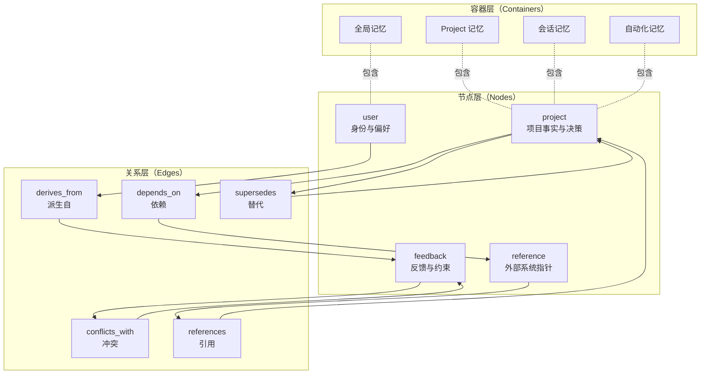
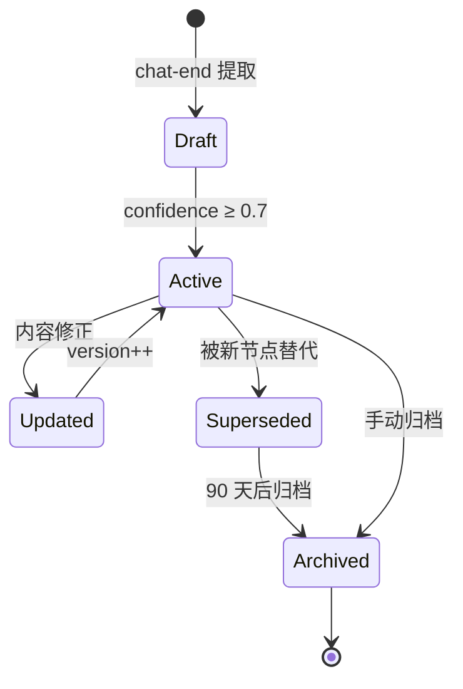
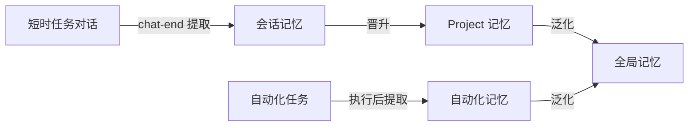

# md+json 工作图谱数据模型

> **文档版本**: v0.6-rev11
> **更新时间**: 2026-06-02
> **核心问题**：如何设计 banto 记忆的存储格式，采用 md+json 双存结构，支持节点 / 关系 / 演化的工作图谱模型？
>
> **设计目标**：从平铺列表升级为结构化图谱，支持多维度索引、关系追溯、版本演化，同时保持人类可读性

---

## 重要变更说明（v0.6-rev11）

> **节点 Schema 字段扩展（与 01/06 文档对齐）**：
>
> 自 v0.6-rev11 起，节点 JSON 新增以下字段：
>
> | 字段 | 类型 | 说明 |
> |------|------|------|
> | `lifecycleStatus` | enum: active / archived / revoked / superseded / promoted | 统一生命周期状态，替代散落的 archived/revoked/promotedToSkill 布尔标记 |
> | `evidenceQuotes` | string[] | 用户原话引用（≤2 条），供下钻回溯 |
> | `dimension` | string | 记忆所属维度（profile: motivation/achievement_orientation/control_preference/risk_attitude；task-context: goal_structure/role_relation/constraint_context） |
> | `value` | string | 维度取值（仅 profile 适用，含 balanced / context_switching） |
> | `dimension_fields` | object | 各 type 特有结构化字段（rules: source+strength+consequence；experience: causality+transferability+memoryType；resource: cognitionAgent+subType+metaKnowledge+trustLevel+entryPoint） |
> | `supersededBy` | string | 取代本节点的新节点 id（lifecycleStatus=superseded 时） |
> | `promotedToSkillId` | string | 晋升到的 SKILL id（lifecycleStatus=promoted 时） |
>
> **Schema 权威版本**仍在 [07-dual-end-memory-architecture.md 第 7.1 节](./07-dual-end-memory-architecture.md)，本文档仅做补充索引。
>
> **提取提示词模板**（定义各 type 维度字段的具体取值与规则）详见 [01 文档第三节](./01-memory-layers-and-containers.md)。

## 重要变更说明（v0.6-rev7）

> **本文档原 Schema 设计（基于 user/feedback/project/reference 4 类型）已废弃**。
>
> **新 Schema 权威版本在 [07-dual-end-memory-architecture.md 第 7.1 节](./07-dual-end-memory-architecture.md)**，采用 5 type 体系：
> - `profile` — Q1 我为谁工作
> - `task-context` — Q2 我在做什么
> - `rules` — Q3 什么不能做
> - `experience` — Q4 之前怎么做过
> - `resource` — Q5 有什么可用资源（subType 区分专家/技能/连接器/知识库）
> - `summary` — L1/L2 摘要节点
>
> 本文档保留以下仍然有效的内容作为细化补充：
> - 关系 Schema（`memory-edge.json`）
> - Markdown 模板设计
> - 目录布局（已在 07 第 6.2 节更新为按 5 type 分组）
> - 多维索引设计
> - 图谱演化机制
> - 向后兼容与迁移

---

## 设计原则

1. **双存互补** — JSON 用于结构化查询与索引，Markdown 用于人类阅读与版本控制，两者必须保持同步
2. **图谱优先** — 记忆不是孤立条目，而是节点 + 关系的有向图，支持"决策 → 约束"、"任务 → 知识"等语义关系
3. **多维索引** — 支持按类型、置信度、引用次数、时间、容器（短时任务/Project/自动化）快速检索
4. **渐进迁移** — 与现有 `MEMORY.md` 索引兼容，支持从平铺列表向图谱结构平滑升级
5. **演化可追溯** — 节点新增、关系变更、置信度调整必须留痕，支持回溯与审计

---

## 图谱结构概览

### 核心概念模型



### 节点与关系的语义

| 元素 | 类型 | 说明 | 示例 |
|---|---|---|---|
| **节点** | user | 用户身份、角色、偏好、知识背景 | "用户是前端工程师，熟悉 Vue 3" |
| | feedback | 用户反馈、约束、偏好指令 | "不要使用 any 类型" |
| | project | 项目事实、决策、里程碑 | "项目采用 Electron + Vue 3 架构" |
| | reference | 外部系统、文档、API 指针 | "Bug 追踪在 Linear INGEST 项目" |
| **关系** | derives_from | 决策 A 派生自约束 B | feedback → project |
| | conflicts_with | 约束 A 与约束 B 冲突 | feedback ↔ feedback |
| | depends_on | 任务 X 依赖知识 Y | project → reference |
| | supersedes | 决策 A 替代决策 B（版本演化） | project → project |
| | references | 节点 A 引用节点 B（弱关联） | project → user |

---

## JSON Schema 设计

> **重要变更（v0.6-rev7）**：本节原 Schema 已废弃。**当前权威 Schema 见 [07 文档第 7.1 节](./07-dual-end-memory-architecture.md)**。
>
> 以下 Schema 示例保留作为"早期 4 类型设计"的历史参考，**不要按本节实现**。

### 节点 Schema（`memory-node.json`）— 历史参考（已废弃）

> **v0.6-rev2 升级**：节点新增 `level` 字段（`L0` / `L1`），支持二维记忆模型的折叠层。L0 节点保持原设计不变，L1 节点新增 `summary` 相关字段。
> **v0.6-rev7 废弃**：4 类型（user/feedback/project/reference）已重构为 5 type（profile/task-context/rules/experience/resource）。当前 Schema 见 07 文档第 7.1 节。

#### L0 原始节点（保留 banto 4 类型）— 已废弃

```json
{
  "id": "mem_20260529_abc123",
  "level": "L0",                        // v0.6-rev2 新增
  "type": "feedback",
  "container": "project",
  "containerId": "proj_xyz789",
  "sessionId": "sess_20260529_001",
  "content": {
    "title": "禁止使用 any 类型",
    "body": "TypeScript 代码中不得使用 any，必须显式声明类型。\n\n**Why:** 过去因 any 导致运行时类型错误，影响生产环境。\n\n**How to apply:** 代码审查时强制检查，CI 集成 tsc --noImplicitAny。",
    "tags": ["typescript", "code-quality", "constraint"]
  },
  "metadata": {
    "confidence": 0.95,
    "source": "chat-end-extraction",
    "manual": false,
    "createdAt": "2026-05-29T10:30:00Z",
    "updatedAt": "2026-05-29T10:30:00Z",
    "createdBy": "user_001",
    "version": 1
  },
  "relations": {
    "outgoing": [
      {
        "type": "derives_from",
        "targetId": "mem_20260528_def456",
        "weight": 0.8,
        "createdAt": "2026-05-29T10:30:00Z"
      }
    ],
    "incoming": []
  },
  "stats": {
    "referenceCount": 3,
    "lastAccessedAt": "2026-05-29T14:20:00Z",
    "appliedCount": 5
  }
}
```

#### L1 摘要节点（v0.6-rev2 新增）

```json
{
  "id": "mem_20260601_summary001",
  "level": "L1",                        // 折叠层标记
  "type": "summary",                    // 第 5 类节点类型
  "viewKind": "topic",                  // time / topic / container 三视角
  "container": "project",
  "containerId": "proj_xyz789",
  "viewSpec": {                         // 视角范围说明
    "topic": "用户登录模块",             // 主题视角时填
    "timeRange": null,                  // 时间视角时填（如 "2026-W22"）
    "containerScope": null              // 容器视角时填（如 "Project A 全量"）
  },
  "content": {
    "title": "用户登录模块的关键决策摘要",
    "body": "本主题下共有 12 条关键决策...\n\n1. 使用 OAuth 2.0 而非自建账号体系\n   **Why:** 降低维护成本，符合企业 SSO 规范\n2. 采用 JWT Token 而非 Session\n   **Why:** 支持微服务架构\n...",
    "tags": ["login", "auth", "summary"]
  },
  "sourceNodeIds": [                    // L1 反向链接到所有 L0 节点（可逆性保障）
    "mem_20260520_abc",
    "mem_20260522_def",
    "mem_20260525_ghi"
  ],
  "metadata": {
    "confidence": 0.85,
    "createdAt": "2026-06-01T03:00:00Z",
    "createdBy": "chat-end-summarizer",
    "version": 1,                       // 摘要可重新生成（version+1，旧版归档）
    "summarizedAt": "2026-06-01T03:00:00Z",
    "supersedes": null                  // 旧 L1 版本的 id（重生时填）
  },
  "trigger": {
    "type": "bucket-full",              // bucket-full / ttl-flush / manual-rebuild
    "threshold": 12                     // 触发时的 L0 节点数
  },
  "stats": {
    "referenceCount": 5,
    "lastAccessedAt": "..."
  }
}
```

**L1 节点的关键设计**：

- `sourceNodeIds` 字段是**可逆性保障**——任何 L1 摘要都可下钻到具体 L0 节点
- `version` 字段支持"摘要重生"——L0 群发生显著变化后重新生成 L1，旧 L1 归档而非删除
- `trigger` 字段记录摘要被生成的原因，便于调试与审计
- L1 节点本身**不参与晋升与升格**（晋升的对象是 L0），但可作为模式识别的输入

### 关系 Schema（`memory-edge.json`）

```json
{
  "id": "edge_20260529_xyz001",
  "type": "depends_on",
  "sourceId": "mem_20260529_abc123",
  "targetId": "mem_20260528_def456",
  "weight": 0.85,
  "metadata": {
    "reason": "项目架构决策依赖技术选型约束",
    "createdAt": "2026-05-29T10:30:00Z",
    "createdBy": "chat-end-analyzer",
    "confidence": 0.9
  }
}
```

### 字段说明

| 字段 | 类型 | 必填 | 说明 |
|---|---|---|---|
| `id` | string | ✓ | 全局唯一标识，格式 `mem_{date}_{hash}` |
| `type` | enum | ✓ | 节点类型：user / feedback / project / reference |
| `container` | enum | ✓ | 所属容器：global / project / session / automation |
| `containerId` | string | - | 容器 ID（project/session/automation 必填） |
| `sessionId` | string | - | 会话 ID（session 容器必填） |
| `content.title` | string | ✓ | 记忆标题（50 字符内） |
| `content.body` | string | ✓ | 记忆正文（Markdown 格式） |
| `content.tags` | string[] | - | 标签数组，用于分类与检索 |
| `metadata.confidence` | float | ✓ | 置信度 [0, 1]，≥0.7 才落盘 |
| `metadata.source` | enum | ✓ | 来源：chat-end-extraction / manual / migration |
| `metadata.manual` | boolean | ✓ | 是否手动创建 |
| `metadata.version` | int | ✓ | 版本号，每次更新 +1 |
| `relations.outgoing` | array | - | 出边数组（本节点指向其他节点） |
| `relations.incoming` | array | - | 入边数组（其他节点指向本节点） |
| `stats.referenceCount` | int | - | 被引用次数（用于热度排序） |
| `stats.appliedCount` | int | - | 被应用次数（feedback 专用） |

---

## Markdown 模板设计

### 节点 Markdown（`{id}.md`）

```markdown
---
id: mem_20260529_abc123
type: feedback
container: project
containerId: proj_xyz789
sessionId: sess_20260529_001
confidence: 0.95
tags: [typescript, code-quality, constraint]
createdAt: 2026-05-29T10:30:00Z
updatedAt: 2026-05-29T10:30:00Z
version: 1
---

# 禁止使用 any 类型

TypeScript 代码中不得使用 any，必须显式声明类型。

**Why:** 过去因 any 导致运行时类型错误，影响生产环境。

**How to apply:** 代码审查时强制检查，CI 集成 tsc --noImplicitAny。

## 关系

- **派生自** [[mem_20260528_def456]] — 技术选型约束
- **被引用** [[mem_20260529_ghi789]] — 代码审查清单

## 统计

- 引用次数：3
- 应用次数：5
- 最后访问：2026-05-29T14:20:00Z
```

### 索引 Markdown（`MEMORY.md`）

```markdown
# 记忆索引

## 最近更新（按 updatedAt 倒序）

- [禁止使用 any 类型](mem_20260529_abc123.md) — TypeScript 约束，置信度 0.95
- [项目采用 Electron 架构](mem_20260528_def456.md) — 技术选型决策，置信度 0.9

## 按类型分组

### feedback（反馈与约束）

- [禁止使用 any 类型](mem_20260529_abc123.md)
- [优先使用组合式 API](mem_20260527_jkl012.md)

### project（项目事实与决策）

- [项目采用 Electron 架构](mem_20260528_def456.md)

## 按容器分组

### 全局记忆

- [用户是前端工程师](mem_20260520_mno345.md)

### Project 记忆（proj_xyz789）

- [禁止使用 any 类型](mem_20260529_abc123.md)
- [项目采用 Electron 架构](mem_20260528_def456.md)
```

---

## 目录布局设计

### 全局布局

> **v0.6-rev2 升级**：每个容器内部按折叠层分离 `L0/` 和 `L1/` 子目录，`L1/` 下按视角再分。`insights/` 目录承载"沉淀能力"和"优化未来"的产物（来自 chat-end 阶段 2/3）。

```
~/.iflymate/memory/
├── MEMORY.md                          # 全局索引（兼容现有格式）
├── graph.json                         # 图谱元数据（节点/边统计）
├── nodes/                             # 节点存储（按容器 + 折叠层组织）
│   ├── global/
│   │   ├── L0/                        # 全局原始节点
│   │   │   ├── mem_xxx.json
│   │   │   └── mem_xxx.md
│   │   └── L1/                        # 全局摘要节点
│   │       ├── time/                  # 时间视角（按周/月）
│   │       ├── topic/                 # 主题视角（按实体/话题）
│   │       └── container/             # 容器视角（全局总览）
│   ├── projects/
│   │   └── proj_xyz789/
│   │       ├── MEMORY.md              # 项目索引
│   │       ├── L0/                    # 项目原始节点
│   │       │   ├── mem_xxx.json
│   │       │   └── mem_xxx.md
│   │       ├── L1/                    # 项目摘要节点（三视角）
│   │       │   ├── time/
│   │       │   ├── topic/
│   │       │   └── container/
│   │       └── _sessions/             # 会话记忆（每个会话独立子目录）
│   │           └── sess_001/
│   │               ├── L0/
│   │               └── L1/
│   └── automation/
│       └── auto_001/
│           ├── MEMORY.md
│           ├── L0/
│           ├── L1/
│           └── sync_state.json       # 自动化任务的同步状态（借鉴 OpenHuman）
├── edges/                             # 关系存储（独立目录，与 L0/L1 共用）
│   ├── edge_xxx.json
│   └── ...
├── insights/                          # 沉淀能力 + 优化未来的产物
│   ├── skill-candidates/              # Skill 候选
│   ├── optimization-suggestions/      # 流程优化建议
│   ├── capability-gaps/               # 能力缺口提示
│   ├── predictions/                   # 工作预测
│   └── follow-ups/                    # 后续工作建议
└── indexes/                           # 索引文件
    ├── by-type.json                   # 按类型索引
    ├── by-level.json                  # 按折叠层索引（L0/L1）
    ├── by-confidence.json             # 按置信度索引
    ├── by-hotness.json                # 按热度索引（v0.6-rev2 新增）
    ├── by-reference-count.json        # 按引用次数索引
    └── by-time.json                   # 按时间索引
```

### 折叠层目录的职责边界

| 目录 | 内容 | 谁写入 | 何时清理 |
|---|---|---|---|
| `L0/` | 原始记忆节点 | 写入触发时立即生成 | **永久保留**（保证可逆性） |
| `L1/time/` | 时间视角摘要（每周/每月） | chat-end 阶段 1.5 + TTL Flush | 旧版归档（version+1 时） |
| `L1/topic/` | 主题视角摘要（按实体/话题） | chat-end 阶段 1.5 + 主题热度触发 | 旧版归档 |
| `L1/container/` | 容器视角摘要（项目/自动化总览） | TTL Flush（每周一次） | 旧版归档 |
| `insights/` | 三重职能的产物 | chat-end 阶段 2/3 | 用户审核后归档 |

### 双存同步规则

| 操作 | JSON | Markdown | 索引 |
|---|---|---|---|
| 创建节点 | 写入 `nodes/{container}/{id}.json` | 写入 `nodes/{container}/{id}.md` | 更新 `MEMORY.md` + `indexes/*.json` |
| 更新节点 | 更新 JSON，`version++` | 更新 Markdown frontmatter + body | 更新索引 |
| 删除节点 | 删除 JSON | 删除 Markdown | 从索引移除 |
| 创建关系 | 写入 `edges/{id}.json` | 在两端节点 Markdown 中添加关系链接 | 更新图谱元数据 |
| 删除关系 | 删除 JSON | 从两端节点 Markdown 中移除链接 | 更新图谱元数据 |

---

## 多维索引设计

### 索引文件结构

#### `indexes/by-type.json`

```json
{
  "user": ["mem_20260520_mno345", "mem_20260519_stu678"],
  "feedback": ["mem_20260529_abc123", "mem_20260527_jkl012"],
  "project": ["mem_20260528_def456"],
  "reference": ["mem_20260526_vwx901"]
}
```

#### `indexes/by-confidence.json`

```json
{
  "high": ["mem_20260529_abc123", "mem_20260528_def456"],
  "medium": ["mem_20260527_jkl012"],
  "low": []
}
```

#### `indexes/by-reference-count.json`

```json
[
  { "id": "mem_20260529_abc123", "count": 5 },
  { "id": "mem_20260528_def456", "count": 3 },
  { "id": "mem_20260527_jkl012", "count": 1 }
]
```

### 查询场景映射

| 查询场景 | 使用索引 | 示例 |
|---|---|---|
| 获取所有 feedback 类型记忆 | `by-type.json` | 代码审查前加载所有约束 |
| 获取高置信度记忆 | `by-confidence.json` | 注入 system prompt 时优先高置信度 |
| 获取热门记忆 | `by-reference-count.json` | 展示"最常用的约束" |
| 获取最近更新记忆 | `by-time.json` | 展示"最近学到的知识" |
| 获取 Project 相关记忆 | 读取 `projects/{projectId}/MEMORY.md` | 进入 Project 详情页时加载 |

---

## 图谱演化机制

### 节点生命周期



### 关系演化规则

| 场景 | 操作 | 示例 |
|---|---|---|
| 决策更新 | 创建 `supersedes` 关系 | 新架构决策替代旧决策 |
| 约束冲突 | 创建 `conflicts_with` 关系 | "禁止 any" vs "允许 any 用于第三方库" |
| 知识依赖 | 创建 `depends_on` 关系 | 项目决策依赖技术选型 |
| 反馈派生 | 创建 `derives_from` 关系 | 代码规范派生自用户反馈 |

### 版本追溯

每次节点更新时：

1. `version` 字段 +1
2. `updatedAt` 更新为当前时间
3. 旧版本内容追加到 Markdown 底部的"历史版本"区块

```markdown
## 历史版本

### v1 (2026-05-28T10:00:00Z)

TypeScript 代码中尽量避免使用 any。

**Why:** 类型安全。

**How to apply:** 代码审查时提醒。
```

---

## 与 banto 产品的映射

### 容器与记忆的对应关系

| 产品容器 | 记忆容器 | 存储路径 | 典型记忆类型 |
|---|---|---|---|
| 短时任务对话 | `session` | `nodes/projects/{projectId}/_sessions/{sessionId}/` | project（任务决策） |
| Project | `project` | `nodes/projects/{projectId}/` | project（里程碑）、reference（外部资源） |
| 自动化 | `automation` | `nodes/automation/{autoId}/` | project（执行记录）、feedback（优化建议） |
| 全局（跨容器） | `global` | `nodes/global/` | user（身份）、feedback（全局约束） |

### 记忆流转路径



---

## 与现状的差异

### v0.3-v0.4 现状

| 维度 | 现状 | 问题 |
|---|---|---|
| 存储格式 | 纯 Markdown | 无结构化索引，查询效率低 |
| 组织方式 | 平铺列表 | 无关系表达，无法追溯决策链 |
| 索引机制 | 单一 `MEMORY.md` | 无多维索引，无法按置信度/热度排序 |
| 版本管理 | 无 | 无法回溯历史版本 |
| 容器映射 | 隐式（目录结构） | 无显式 `container` 字段 |

### v0.6 升级方向

| 维度 | 升级方向 | 收益 |
|---|---|---|
| 存储格式 | md+json 双存 | 结构化查询 + 人类可读 |
| 组织方式 | 节点 + 关系图谱 | 支持决策链追溯、冲突检测 |
| 索引机制 | 多维索引文件 | 按类型/置信度/热度/时间快速检索 |
| 版本管理 | `version` 字段 + 历史区块 | 支持回溯与审计 |
| 容器映射 | 显式 `container` 字段 | 与产品容器强绑定 |

---

## 向后兼容与迁移

### 现有 Markdown 记忆迁移

**迁移脚本逻辑**：

1. 读取现有 `MEMORY.md` 索引
2. 解析每个 `.md` 文件的 frontmatter
3. 生成对应的 `.json` 文件（补充缺失字段）
4. 提取 `[[link]]` 语法，生成关系边
5. 重建多维索引文件

**字段映射规则**：

| 现有字段 | 新字段 | 默认值 |
|---|---|---|
| `name` | `id` | 保持不变 |
| `type` | `type` | 保持不变 |
| `description` | `content.title` | 截取前 50 字符 |
| 正文 | `content.body` | 保持不变 |
| 无 | `container` | 根据路径推断（global/project） |
| 无 | `confidence` | 0.8（默认中等置信度） |
| 无 | `version` | 1 |

### 兼容性保证

1. **索引兼容** — 保留 `MEMORY.md` 格式，工具可继续读取
2. **路径兼容** — 目录结构保持 `nodes/global/` 和 `nodes/projects/{projectId}/`
3. **渐进升级** — 新记忆使用 md+json 双存，旧记忆按需迁移

---

## 关键判断（需用户确认）

### 1. 关系存储方式

**选项 A**：关系存储在独立 `edges/` 目录（当前方案）

- ✅ 优点：关系独立管理，支持复杂查询（如"找出所有 depends_on 关系"）
- ❌ 缺点：需要同步维护节点 Markdown 中的关系链接

**选项 B**：关系仅存储在节点 JSON 的 `relations` 字段

- ✅ 优点：数据一致性更强，无需独立文件
- ❌ 缺点：查询关系需要遍历所有节点

**推荐**：选项 A，因为 banto 需要支持"找出所有冲突约束"等全局关系查询。

### 2. 置信度阈值

**问题**：chat-end 提取的记忆，置信度多少才落盘？

- 当前方案：≥0.7
- 备选方案：≥0.8（更严格）或 ≥0.6（更宽松）

**推荐**：保持 0.7，平衡召回率与准确率。

### 3. 会话记忆晋升时机

**问题**：会话记忆何时晋升为 Project 记忆？

- 选项 A：手动晋升（用户在 UI 中点击"保存到 Project"）
- 选项 B：自动晋升（会话结束后，置信度 ≥0.9 的记忆自动晋升）
- 选项 C：混合模式（自动晋升 + 用户可手动干预）

**推荐**：选项 C，自动晋升减少用户负担，手动干预保留控制权。

---

## 总结

本文档设计了 banto 记忆的 md+json 双存工作图谱数据模型，核心特性：

1. **节点 + 关系** — 支持 4 类节点（user/feedback/project/reference）和 5 类关系（derives_from/conflicts_with/depends_on/supersedes/references）
2. **双存互补** — JSON 用于结构化查询，Markdown 用于人类阅读，通过同步机制保持一致
3. **多维索引** — 支持按类型、置信度、引用次数、时间快速检索
4. **容器映射** — 显式 `container` 字段，与短时任务/Project/自动化强绑定
5. **演化可追溯** — 版本号 + 历史区块，支持回溯与审计
6. **向后兼容** — 保留 `MEMORY.md` 索引，支持从平铺列表渐进迁移

下一步需要 Agent C 设计运转机制（写入触发、chat-end 整理、读取召回、晋升规则），Agent D 设计与支撑体系的耦合（专家/技能/连接器 如何与记忆联动）。注：Identity 已在产品中下架，不再纳入本设计。
