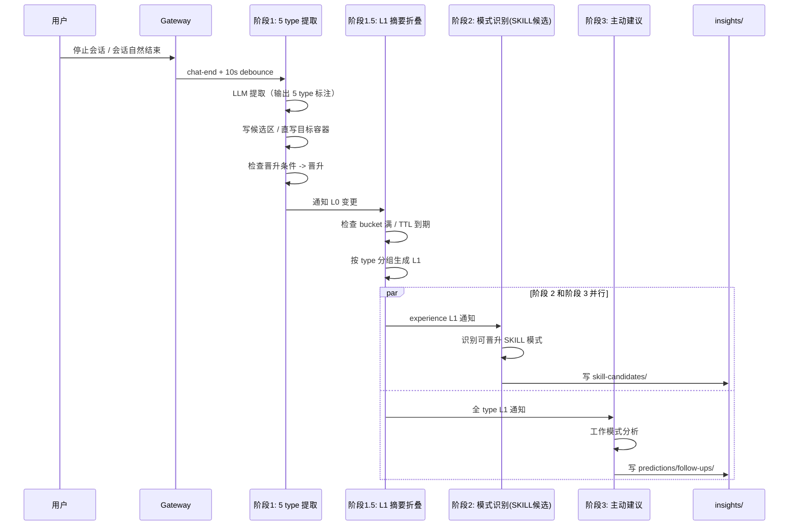
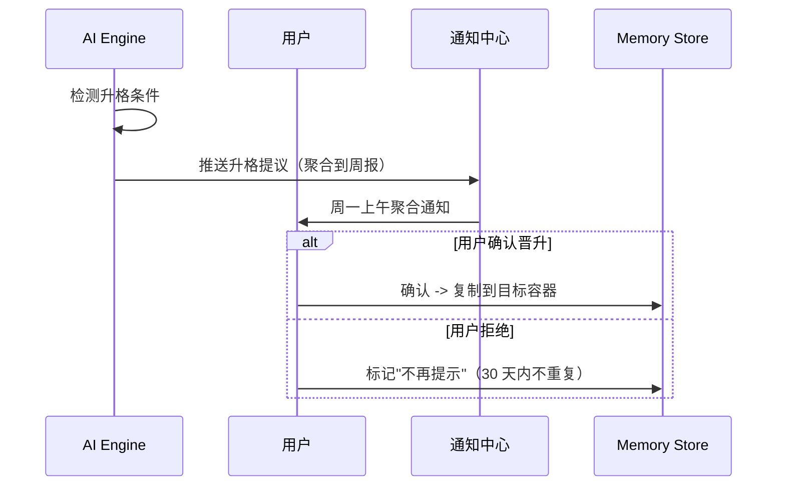

# 记忆系统运转机制

> **文档版本**: v0.6-rev7
> **更新时间**: 2026-06-01
> **核心问题**：记忆如何写入、如何按 5 槽位注入、如何回溯、如何升格？chat-end 如何触发四阶段流程？

---

## 一、本文档回答的问题

1. **写入触发**：记忆何时写入？谁触发？如何按 5 type 分类？
2. **chat-end 整理**：四阶段流程如何工作？
3. **读取召回**：必读层 5 槽位如何组装？任务相关层如何按需召回？按需检索层如何下钻？
4. **回溯机制**：决策链追溯、版本历史、时间线视图如何实现？
5. **升格机制**：会话候选 → 项目 → 全局；experience → SKILL 如何运作？

---

## 二、设计原则

### 原则 1：召回围绕 5 个本质问题组装

agent 看到的 system prompt 是"5 段答案"，不是"一堆记忆条目"。每条召回的记忆必须能回答 5 个本质问题之一。

### 原则 2：写入必须明确归属 5 type

Extractor 在提取时必须为每条记忆指定 type（profile/task-context/rules/experience/resource）。无法归类的内容要么是过程数据（不入库），要么是设计盲区（重新审视）。

### 原则 3：chat-end 整理是核心机制，异步执行

会话结束是最自然的记忆整理时机。四阶段流程异步执行不阻塞用户。

### 原则 4：升格需要明确条件 + 用户审核

记忆晋升（会话 → 项目、项目 → 全局、experience → SKILL）由系统提议 + 用户审核，不静默自动完成。

### 原则 5：分层召回避免上下文污染

必读层固定 5 槽位（每槽预算固定），任务相关层按关键词召回，按需检索层 agent 主动调用。

---

## 三、写入触发机制

### 3.1 四种写入触发时机

| 触发时机 | 触发者 | 写入内容 | 置信度 | 典型场景 |
|---------|--------|---------|--------|---------|
| **chat-end 整理** | 系统自动 | 5 type 候选 + L1 摘要 | 中高 | 每次会话结束后自动触发 |
| **AI 实时观察** | AI 主动标记 | profile / rules / experience | 高 | 对话中 AI 判断"这值得记住" |
| **用户显式保存** | 用户手动 | 任意 5 type | 最高 | 用户点击"记住这个" |
| **关键节点触发** | 系统钩子 | task-context / resource | 高 | Project 创建、专家启用、连接器安装 |

### 3.2 写入优先级

```
用户显式保存 > AI 实时观察 > 关键节点触发 > chat-end 整理
```

### 3.3 写入路径：先候选区，后晋升

> **重要变更（v0.6-rev7）**：所有 chat-end 自动提取的记忆先写入会话候选区 `local/_sessions/<sid>/candidates/`，满足晋升条件后再写入项目/全局容器。用户显式保存可直接写目标容器。

```
chat-end Extractor：
  提取记忆 + 标注 type
  → confidence ≥ 0.9 → 直接写项目/全局容器
  → confidence < 0.9 → 写 _sessions/<sid>/candidates/

会话结束（阶段 1）：
  扫描 candidates/ 中所有记忆
  → 满足晋升条件（见第七节）→ 复制到目标容器
  → 不满足 → 保持候选，7 天后归档（不删除）
```

### 3.4 写入质量保障

| 保障机制 | 说明 |
|---------|------|
| **Type 强制** | Extractor 必须输出 type 字段，否则记忆不入库 |
| **置信度阈值** | chat-end 提取记忆 confidence ≥ 0.7 才落盘 |
| **去重检测** | 写入前 bigram Jaccard 相似度 > 0.8 → 合并 |
| **来源标记** | 每条记忆标记 source（chat-end/ai-observation/user-explicit/system-hook） |
| **版本控制** | 记忆更新时保留历史版本（最多 5 个） |

### 3.5 Extractor 提取 5 type 的规则

| Type | 提取关键词/特征 |
|------|---------------|
| `profile` | "我喜欢/我习惯/我希望/我是..."；输出格式偏好；表达方式偏好 |
| `task-context` | 项目目标、阶段描述、客户约束、里程碑、范围说明（仅在 Project 内会话提取） |
| `rules` | "不要/禁止/必须/约束/不能/规范" |
| `experience` | "决定/选择/因为/原因/考虑到/教训/方法是" |
| `resource` | "参考 X 文档/用 Y 工具/找 Z 专家/通过 W 连接器" |

模糊提取由 LLM 判断归属，输出时必须带 type 字段，否则记忆不入库。

---

## 四、chat-end 四阶段流程

### 4.1 整体流程



### 4.2 阶段 1：5 type 提取与候选区写入

**输入**：最近 20 条对话消息

**LLM Prompt 关键约束**：

```
请从以下对话中提取记忆，每条记忆必须指定 type，仅允许 5 个值之一：
- profile: 用户身份/岗位/偏好/表达习惯
- task-context: 项目目标/阶段/客户约束（仅项目内会话）
- rules: 不能做什么的约束（个人/团队/合规）
- experience: 决策依据/方法论种子/领域知识
- resource: 文档/工具/专家/技能/连接器指针

无法归类的内容请丢弃，不要硬塞到任意 type。
每条记忆必须含 confidence (0-1) 和 reason (为什么属于该 type)。
```

**输出处理**：

```
for 每条提取的记忆 m:
  if m.type 不在 5 type 内 -> 丢弃
  if m.confidence < 0.7 -> 丢弃
  if 与已有记忆相似度 > 0.8 -> 合并
  
  if m.confidence >= 0.9:
    直接写目标容器（按 type 路由）
  else:
    写 _sessions/<sid>/candidates/
```

### 4.3 阶段 1.5：L1 摘要折叠（按 type 差异化策略）

> **重要变更（v0.6-rev7）**：L1 摘要不再按"时间/主题/容器"三视角生成，而是**按 type 分组**生成，且每个 type 的总结策略不同。

**触发条件**（任一满足）：

| 条件 | 阈值 |
|------|------|
| Bucket 满 | profile 5 / task-context 10 / rules 15 / experience 20 / resource 10 |
| TTL 到期 | profile 每月 / task-context 每周 / rules 实时（变更触发）/ experience 每周 / resource 实时 |
| 关键变更 | rules / resource 新增立即重生 |

**生成方式（按 type 差异化）**：

| Type | 存储方式 | L1 总结策略 | L1 内容形态 |
|------|---------|-----------|------------|
| `profile` | 完整内容 | LLM 合并 personal + 远程 identity，**控制总字符数 ≤ 600** | 一段完整画像描述，全文导入 prompt |
| `task-context` | 完整内容 | LLM 合并当前 Project 所有 task-context L0，**递进式编写**（一般不建议，防跑偏；遇长内容才递进） | 一段完整项目状态，全文导入 prompt |
| `rules` | 类型+条目 | 元数据聚合（不需 LLM），**自动去重 + 最多 15-20 条** | 按优先级排序的条目清单，全量导入 prompt |
| `experience` | 元数据概要+文件索引 | 不做整体摘要，**只保留概要索引**（title + summary + tags + fileRef） | 概要索引列表，agent 按需下钻完整内容 |
| `resource` | 元数据概要+文件索引 | 元数据聚合（不需 LLM），**只保留概要索引**（title + summary + subType + fileRef）；tool 类型关联 SKILL | 概要索引列表，agent 按需下钻完整内容 |

**rules 去重规则**：

```
for 新增 rules B:
  扫描已有 rules 列表
  if 存在 B' 使得 bigram_jaccard(B, B') > 0.8:
    合并 B 到 B'（保留优先级更高的版本）
  else:
    追加 B
  
  if 总条目数 > 20:
    按优先级淘汰（个人偏好类先淘汰，合规类永不淘汰）
    保留 15-20 条
```

**experience / resource 概要索引格式**：

```yaml
# experience 概要索引（注入 prompt 用）
- id: exp_jwt_decision_001
  title: "选 JWT 而非 Session"
  summary: "支持分布式部署 + 移动端友好"
  tags: [auth, architecture]
  fileRef: "local/projects/proj_xyz/experience/exp_jwt_decision_001.md"
  confidence: 0.92
  referenceCount: 3

# resource 概要索引（注入 prompt 用）
- id: res_feishu_connector
  title: "飞书 MCP 连接器"
  summary: "只读：文档/日历；不可发消息"
  subType: connector
  fileRef: "local/global/resource/res_feishu_connector.md"
  relatedSkillIds: [skill_feishu_doc_reader]  # tool 类型关联 SKILL
```

**L1 节点 Schema**：

```json
{
  "id": "summary_proj_xyz_taskcontext_v3",
  "level": "L1",
  "type": "summary",
  "subjectType": "task-context",     // L1 摘要的目标 type
  "scope": "project",
  "scopeId": "proj_xyz",
  "content": {
    "title": "Project XYZ 任务上下文",
    "body": "目标：金融客户合规整改...\n当前阶段：审计准备期...",
    "tags": ["compliance", "audit"]
  },
  "sourceNodeIds": ["mem_001", "mem_005", "mem_012"],
  "version": 3,
  "trigger": { "type": "ttl", "value": "weekly" }
}
```

### 4.4 阶段 2：模式识别（基于 experience L1）

仅扫描 experience type 的 L1 摘要：

```
扫描 experience L1：
  识别"跨项目重复的决策模式"
  识别"高置信度方法论种子"
  
  → 生成 SKILL 候选 → 写 insights/skill-candidates/
  → 等待用户在 SKILL 管理页审核
```

详见 [07-dual-end-memory-architecture.md 第 3.4 节](./07-dual-end-memory-architecture.md)（memory-review 内置 skill）。

### 4.5 阶段 3：主动建议

基于全 5 type L1 摘要做工作模式分析：

```
扫描所有 L1：
  识别"频繁需要某能力但缺失"（能力缺口提示）
  识别"任务完成 → 后续"链（后续工作建议）
  识别"低效模式"（流程优化建议）

→ 写 insights/predictions/, follow-ups/, optimization-suggestions/
→ 低风险建议（预测/后续）在用户空闲时主动推送
→ 高风险建议（流程优化）等用户主动询问
```

---

## 五、读取召回：必读层 5 槽位（核心）

> **重大变更（v0.6-rev7）**：必读层从"L1 + 复合分排序"重构为**固定 5 槽位**，每个槽位对应一个本质问题。

### 5.1 必读层 5 槽位结构

```
┌────────────────────────────────────────────────────────┐
│ 必读层（固定 5 槽位）                                    │
├────────────────────────────────────────────────────────┤
│ [槽 1] 我为谁工作         ~600 字符                      │
│   方式：profile 全文导入                                 │
│   来源：合并本地软画像 + 远程硬画像                       │
│   总结：控制完整字符数 ≤ 600                             │
│                                                        │
│ [槽 2] 我在做什么         ~1000 字符                     │
│   方式：task-context 全文导入                            │
│   来源：当前 Project task-context                       │
│   总结：递进式编写（一般不建议，防跑偏；遇长才递进）      │
│                                                        │
│ [槽 3] 什么不能做         ~1000 字符                     │
│   方式：rules 全量条目导入                            │
│   来源：合规 > 团队 > 项目 > 个人（自动去重，≤20 条）    │
│   预算优先级：1（最高，预算紧张时优先保此槽）             │
│                                                        │
│ [槽 4] 有什么可用资源     ~600 字符                      │
│   方式：resource 概要索引导入（title + summary + subType）│
│   来源：全部 scope 的 resource 概要                     │
│   关联：tool 类型的 resource 关联对应 SKILL              │
│                                                        │
│ [槽 5] 高频历史经验       ~800 字符                      │
│   方式：experience 概要索引导入（title + summary + tags） │
│   来源：按复合分排序 top-3~5 条概要                     │
│   下钻：agent 通过 memory_query 按 fileRef 读完整内容   │
└────────────────────────────────────────────────────────┘
```

**关键设计**：
- 槽 1（profile）和槽 2（task-context）是**全文导入**，不做摘要裁剪——agent 需要完整画像和完整任务上下文
- 槽 3（rules）是**条目全量导入**，自动去重后最多 15-20 条
- 槽 4（resource）和槽 5（experience）是**概要索引导入**——只给目录，agent 按需下钻完整内容
- 槽 3 优先级最高，4000 字符紧张时优先保槽 3

### 5.2 5 槽位组装算法

```python
def build_must_read_layer(user_id, project_id, session_input):
    slots = {}
    
    # 槽 3 优先（合规底线最重要）
    slots[3] = load_rules_items(
        sources=[
            'remote/enterprise/rules',     # 合规
            f'remote/teams/{user.team}/rules',  # 团队规范
            f'local/projects/{project_id}/rules',  # 项目约束
            'local/global/rules'            # 个人约束
        ],
        order='priority',       # 合规 > 团队 > 项目 > 个人
        dedup_threshold=0.8,    # bigram Jaccard 去重
        max_items=20,           # 最多 20 条
        budget=1000
    )
    
    # 槽 1 用户画像（全文导入，控制总字符数）
    slots[1] = load_profile_full_text(
        local='local/global/profile',
        remote='remote/identity/user.json',
        max_chars=600           # 总字符数上限
    )
    
    # 槽 2 任务上下文（全文导入，仅 Project 内会话）
    if project_id:
        slots[2] = load_task_context_full_text(
            project=f'local/projects/{project_id}/task-context',
            max_chars=1000,
            progressive=True    # 遇长内容递进式（先核心目标+阶段，后续按需）
        )
    else:
        slots[2] = None  # 短时任务对话无项目，槽 2 留空
    
    # 槽 4 资源概要索引（只给目录，不给完整内容）
    slots[4] = load_resource_index(
        sources=[
            f'remote/enterprise/resource',
            f'remote/teams/{user.team}/resource',
            f'local/projects/{project_id}/resource' if project_id else None,
            'local/global/resource'
        ],
        fields=['title', 'summary', 'subType', 'relatedSkillIds'],  # 概要字段
        budget=600
    )
    
    # 槽 5 历史经验概要索引（只给目录，不给完整内容）
    slots[5] = load_experience_index(
        sources=[
            f'local/projects/{project_id}/experience' if project_id else None,
            'local/global/experience'
        ],
        keywords=extract_keywords(session_input),
        fields=['title', 'summary', 'tags', 'fileRef'],  # 概要字段
        sort_by='composite_score',
        k=5,                    # top-5 概要
        budget=800
    )
    
    # 预算溢出处理：按优先级裁剪（槽3 > 槽2 > 槽1 > 槽4 > 槽5）
    return assemble_slots(slots, total_budget=4000)
```

### 5.3 不同任务类型的槽位差异

| 任务类型 | 槽 1 profile | 槽 2 task-context | 槽 3 rules | 槽 4 resource | 槽 5 experience |
|---------|-------------|------------------|--------------|--------------|----------------|
| **短时任务对话（无 Project）** | 全量 | 留空 | 全局 + 远程 | 全局 + 远程 | 全局 top-3 |
| **Project 内继续推进** | 全量 | 当前 Project | 全部层级 | 全部层级 | 项目 + 全局 top-3 |
| **专家执行** | 全量 | 全量 | 全部 + 该专家边界 | 该专家相关 | 该专家相关 top-3 |
| **技能执行** | 全量 | 全量 | 全部 + 该技能边界 | 该技能相关 | 该技能历史使用反馈 |
| **自动化触发** | 全量（带"自动化语境"标记） | 关联 Project | 全部 + 自动化特定 | 关联资源 | 关联 Project top-3 |

### 5.4 system prompt 注入示例

```xml
<system_memory>
<!-- [槽 1] 我为谁工作 -->
<profile>
用户是合规项目经理，所属安全合规部。岗位日常：审计准备、合规检查、客户沟通。
输出偏好：先结论后细节，500 字以内。表达偏好：业务语言，不用感叹号。
沟通方式：重要决定先生成草稿，确认后再发送。
</profile>

<!-- [槽 2] 我在做什么 -->
<task_context>
项目：金融客户合规整改（Project XYZ）
目标：Q2 完成 ISO 27001 审计准备
当前阶段：审计准备期，剩余 3 周
关键里程碑：M1 风险评估（已完成）、M2 控制设计（进行中）、M3 审计预演（5-15 前）
客户 A 约束：周五前发邮件，正文简短附件详细
</task_context>

<!-- [槽 3] 什么不能做 -->
<rules>
[合规-最高] 客户 PII 数据禁止存入第三方云盘
[合规-最高] 审计相关材料必须通过加密通道传输
[团队规范] 周报必须含'本周完成 / 下周计划 / 风险提示'三段
[项目约束] 本 Project 客户数据禁止发外部
[个人偏好] 不要自动发送，先生成草稿
[资源边界] 飞书连接器只读不写
</rules>

<!-- [槽 4] 有什么可用资源 -->
<resource>
知识库文档：
  - 周报模板（飞书文档 X）
  - ISO 27001 控制清单（企业 KB）
专家：
  - code-reviewer（适用：核心模块审查）
技能：
  - 周报生成 SKILL（输入本周事项，输出三段式）
连接器：
  - 飞书 MCP（只读：文档/日历）
</resource>

<!-- [槽 5] 高频历史经验 -->
<experience>
1. 4-18 决策：推迟支付模块重构（Q2 优先合规整改，客户 A 合同要求）
2. 4-20 沟通：客户 A 偏好邮件简短附件详细
3. 上次周报格式版本（用户确认采纳的三段式模板）
</experience>
</system_memory>
```

---

## 六、任务相关层 + 按需检索层

### 6.1 任务相关层（按关键词召回）

预算 3000 字符，仅召回必读层未覆盖的"任务相关细节"：

| 召回内容 | 召回方式 | 触发场景 |
|---------|---------|---------|
| 与任务相关的具体 rules 细节 | 关键词 + relatedResourceId 匹配 | 用户提到具体专家/连接器 |
| 与任务相关的 experience 详情 + 决策链 | 关键词 + 图谱遍历（derives_from） | 用户提到具体决策主题 |
| 与任务相关的 resource 具体使用方式 | 关键词 + subType 过滤 | 用户问"怎么用 X" |

**不召回的内容**（避免与必读层重复）：
- profile（必读层已全量注入）
- task-context（必读层已全量注入）
- rules 的概览清单（必读层已注入）
- resource 的概览清单（必读层已注入）

### 6.2 按需检索层（agent 主动）

agent 通过 `memory_query` 工具按 type + 关键词主动查询：

```typescript
memory_query({
  type?: 'profile' | 'task-context' | 'rules' | 'experience' | 'resource',
  scope?: 'personal' | 'project' | 'team' | 'enterprise',
  keywords?: string[],
  limit?: number
})
```

典型场景：

| 用户问 | agent 调用 |
|--------|-----------|
| "之前我们对客户 A 做过哪些类似决策？" | `query type=experience, keywords=[客户A]` |
| "团队对周报格式有什么具体要求？" | `query type=rules, scope=team, keywords=[周报]` |
| "这件事能不能做？" | `query type=rules, keywords=[相关动词]` |
| "类似项目我们怎么处理过？" | `query type=experience, scope=team, limit=5` |

### 6.3 决策链下钻

experience 节点支持决策链追溯，agent 可以通过 `memory_query` 的 `traverse` 参数下钻：

```typescript
memory_query({
  nodeId: 'mem_001',
  traverse: 'derives_from',  // 向上追溯依据
  depth: 3
})
```

返回完整决策链：当前决策 → 评审会结论 → 企业规则 → 客户合同。

---

## 七、复合召回排序算法（用于槽 5 + 任务相关层）

### 7.1 核心公式

```
score = α × hotness + β × confidence + γ × task_relevance + δ × user_signal
默认权重：α=0.35, β=0.30, γ=0.30, δ=0.05
```

### 7.2 各维度计算

| 维度 | 公式 | 数据来源 |
|------|------|---------|
| **hotness** | `recency × 0.5 + frequency × 0.5` | `updatedAt` + `referenceCount` |
| **confidence** | 直接读取 | frontmatter `confidence` 字段（0-1） |
| **task_relevance** | `max(keyword_score, tag_score) × 0.7 + container_score × 0.3` | 对话关键词 vs 记忆 title/tags/body |
| **user_signal** | `manual: true` -> 1.0, 否则 0.0 | 用户手动标记 |

### 7.3 子公式

```
hotness:
  recency = exp(-Δt / 30)                                    // Δt=距上次引用天数，30天半衰期
  frequency = log(1 + refCount) / log(1 + maxRefCount)       // 对数归一化到 [0,1]

task_relevance:
  keyword_score = 命中关键词数 / 对话总关键词数               // 0-1
  tag_score = |对话标签 ∩ 记忆标签| / |对话标签|             // 0-1
  container_score = 同项目?1.0 : 全局?0.5 : 其他?0.2
```

### 7.4 必读层不走复合分

必读层的槽 1-4 都是 L1 摘要（按 type 直接读），槽 5 才走复合分排序。这与早期"必读层 L1 + 复合分"的设计不同。

---

## 八、回溯机制

### 8.1 三种回溯视图

| 视图 | 用途 | 实现 |
|------|------|------|
| **决策链追溯** | 追溯"为什么这样决定" | 从 experience 节点遍历 `derives_from` 关系 |
| **版本历史** | 查看记忆如何演化 | 读取 `versions` 数组 |
| **时间线视图** | 按时间顺序查看记忆 | 按 `createdAt` 排序 + type 过滤 |

### 8.2 决策链示例

```
用户问："为什么不重构支付模块？"

agent 调用：
  memory_query(type=experience, keywords=[支付模块, 重构], traverse=derives_from)

返回链路：
  当前决策（experience）：不重构支付模块（2026-04-18）
    derives_from
  评审会结论（experience）：Q2 优先稳定性和合规整改
    derives_from
  企业规则（experience，scope=enterprise）：金融客户合规要求
    derives_from
  客户 A 合同（experience，含 reference 指向合同文档）

agent 回答：
  "根据 4-18 评审会决定，支付模块重构推迟到 Q3，原因是 Q2 必须优先完成
  金融客户合规整改（客户 A 合同要求）。"
```

---

## 九、升格机制

### 9.1 三种升格路径

| 升格路径 | 触发条件 | 审核方式 |
|---------|---------|---------|
| **会话候选 → 项目** | confidence ≥ 0.9 自动；或同记忆被 ≥ 2 个 session 重复提取 | 自动 |
| **项目 → 全局** | rules 在 ≥ 2 个项目中重复；experience 在 ≥ 3 个项目中重复 | banto 提议 + 用户确认 |
| **experience → SKILL** | 同主题 experience ≥ 5 次引用 + 跨 ≥ 3 项目 | memory-review 提议 + 用户编辑 |

### 9.2 升格的 type 限制

不是所有 type 都能升格：

| Type | 可升格路径 |
|------|-----------|
| `profile` | 仅会话候选 → 全局（不晋升到项目，profile 不绑项目） |
| `task-context` | 仅会话候选 → 项目（不晋升到全局，task-context 必须绑 Project） |
| `rules` | 会话候选 → 项目 → 全局（多级晋升） |
| `experience` | 会话候选 → 项目 → 全局；项目 experience → SKILL（横向晋升） |
| `resource` | 会话候选 → 项目 → 全局（多级晋升） |

### 9.3 升格审核流程



---

## 十、与现状的差异

### 10.1 当前 v0.3-v0.4 短板

| 短板 | 当前现状 | v0.6-rev7 升级 |
|------|---------|---------------|
| **召回无 5 问题对应** | 全量记忆按 confidence + recency 排序 | 5 槽位固定结构 |
| **type 碎片化** | 4+ 类型语义重叠 | 5 type 明确归属 |
| **会话过程数据混入记忆** | reasoning/tool-chain 与长期记忆混存 | 移出记忆系统 |
| **L1 摘要按视角生成复杂** | 时间/主题/容器三视角 | 按 type 分组生成 |
| **无候选区** | 直接写共享区 | 候选区缓冲 + 晋升机制 |
| **无回溯能力** | 无决策链 | derives_from 关系图谱 |

### 10.2 关键升级方向

| 升级点 | 方案 | 对应原则 |
|--------|------|---------|
| **5 type 体系** | 砍掉过度细分，只保留 5 type | 围绕 5 个本质问题 |
| **必读层 5 槽位** | 固定结构，每槽预算固定 | agent 看 5 段答案 |
| **会话过程移出** | reasoning/tool-chain 归会话日志 | 记忆只存"对未来有用的" |
| **L1 按 type 分组** | 不再三视角 | 直接对应槽位 |
| **候选区机制** | _sessions/<sid>/candidates/ 缓冲 | 防低质量记忆污染共享区 |
| **决策链追溯** | derives_from 图谱遍历 | experience 可下钻 |

---

## 十一、关键设计决策（已确认）

| 决策 | 选择 | 理由 |
|------|------|------|
| chat-end 整理执行方式 | 异步执行 | 不阻塞用户 |
| 升格是否需要用户审核 | 需要 | 避免误判 |
| 按需检索层是否提供工具 | 提供 `memory_query` | 支持决策链追溯 |
| 必读层结构 | 固定 5 槽位 | 直接对应 5 个本质问题 |
| L1 摘要生成方式 | 按 type 分组 | 直接对应槽位 |
| 会话过程数据归属 | 移出记忆系统 | 不是长期记忆 |
| 候选区机制 | 启用 _sessions/<sid>/candidates/ | 缓冲低质量记忆 |

---

## 十二、总结

记忆系统的运转机制围绕"5 个本质问题"重构：

### 写入路径
```
对话 → Extractor → 强制标 type → 候选区/直写
chat-end 4 阶段 → L1 按 type 分组 → SKILL 候选 → 主动建议
```

### 读取路径
```
agent 启动 → memory-recall → 必读层 5 槽位 + 任务相关 + 按需检索
agent 看到 system prompt = 5 段答案，不是一堆条目
```

### 升格路径
```
候选区 → (条件) → 项目容器 → (条件) → 全局容器
experience → memory-review → SKILL 候选 → 用户确认 → SKILL 库
```

记忆系统不再是"工作日志的存储仓库"，而是**"工作助手在动手前先看一眼的备忘录"**——5 段简洁、可解释、对 agent 直接有用的答案。
