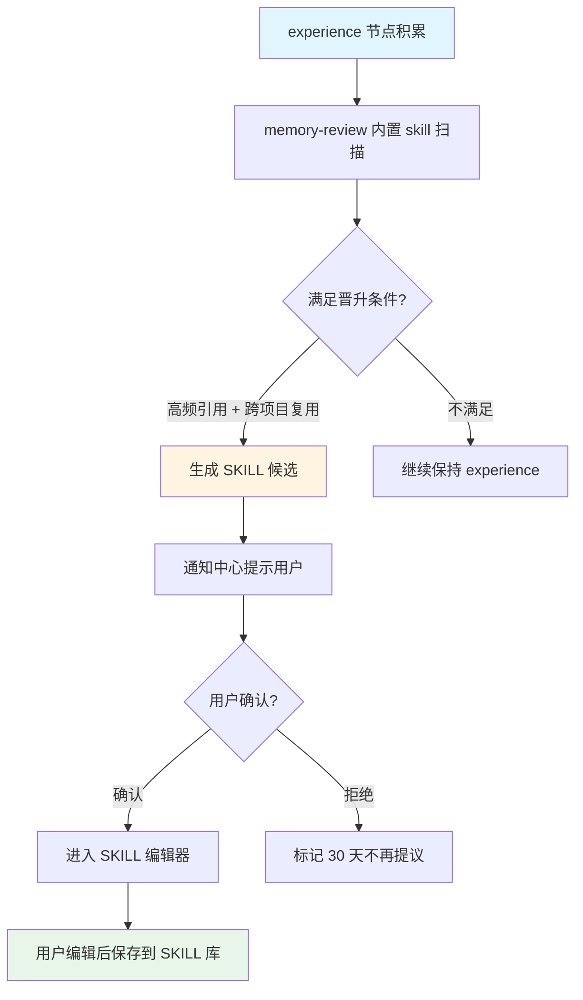
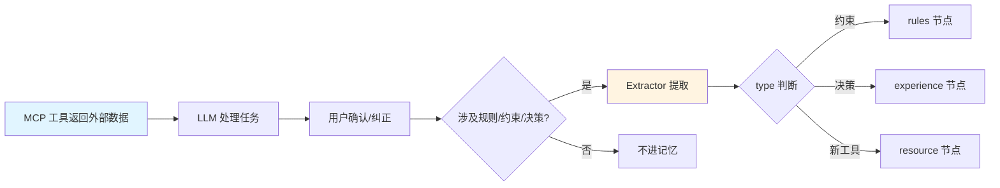
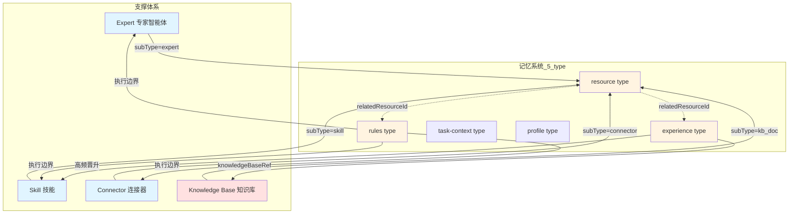

# 记忆系统与支撑体系耦合设计

> **文档版本**: v0.6-rev7
> **更新时间**: 2026-06-01
> **核心问题**：四大支撑体系（专家/技能/连接器/知识库）如何统一归到 `resource` type，并与 5 个本质问题协同？

---

## 一、本文档回答的问题

1. **四大支撑体系为什么统一归 resource type？**
2. **专家智能体如何在 5 type 体系下被记忆？**
3. **技能与 experience type 的边界是什么？**
4. **连接器返回的外部数据为什么不进记忆系统？**
5. **知识库如何作为"事实层"与记忆"工作上下文层"分工？**

---

## 二、设计原则

### 原则 1：四大支撑体系统一归 resource type

> **重大变更（v0.6-rev7）**：原"专家/技能/连接器/知识库"分别用不同字段（relatedExpertIds / relatedSkillIds / sourceConnector / knowledgeBaseRef）的设计被废弃。所有支撑体系统一归 `resource` type，通过 `subType` 区分。

每个支撑体系都是 agent 可调用的"资源"，统一归 resource 后好处：

- agent 在必读层槽 4 一次性看到所有可用资源
- 资源使用边界统一存在 rules type，通过 `relatedResourceId` 关联
- 资源相关历史经验统一存在 experience type，通过 `relatedResourceId` 关联

### 原则 2：记忆是支撑层，不替代能力本身

记忆不能替代专家的专业能力、技能的方法封装、连接器的外部工具、知识库的权威事实。记忆的作用是**承载工作进化系统的三重职能**，让能力体系更好地理解用户与工作场景。

### 原则 3：晋升通道需要用户审核

experience → SKILL 的晋升不是自动完成，必须经过用户确认。

### 原则 4：外部上下文不直接进入长期记忆

连接器返回的外部数据属于**临时上下文**，只有经 LLM 提炼的**决策、约束、偏好**才能沉淀为记忆（experience / rules）。

### 原则 5：反馈闭环驱动记忆演化

技能执行结果、专家调用效果、用户纠正行为都回流到记忆系统，驱动 confidence 动态调整。

---

## 三、四大支撑体系与 5 type 的对应关系

| 支撑体系 | 在记忆系统中的表达 | 服务的本质问题 |
|---------|------------------|--------------|
| **专家智能体** | `resource` (subType=expert) + 关联 rules（专家边界）+ 关联 experience（专家相关历史） | Q5（有什么资源）+ Q3（专家边界）+ Q4（专家历史经验） |
| **技能** | `resource` (subType=skill) + 关联 rules（技能使用约束）；高频 experience 晋升为 SKILL | Q5（有什么 SKILL）+ Q4（experience → SKILL） |
| **连接器（MCP）** | `resource` (subType=connector) + 关联 rules（使用边界） | Q5（有什么连接器）+ Q3（连接器边界） |
| **知识库** | `resource` (subType=kb_doc) + experience 通过 `knowledgeBaseRef` 引用 | Q5（有什么文档）+ Q4（基于事实的决策） |

---

## 四、专家智能体与记忆的联动

### 4.1 专家在 resource type 中的表达

```yaml
# 一个专家 resource 节点
id: res_expert_code_reviewer
type: resource
subType: expert
scope: personal  # 或 team / enterprise
content:
  title: 代码审查专家
  body: |
    适用场景：核心模块审查、安全敏感代码、PR 评审
    专家 ID: code-reviewer
    专家能力：代码风格、安全漏洞、性能问题、测试覆盖率
  tags: [code-review, security, expert]
metadata:
  expertId: code-reviewer  # 业务字段，关联到专家系统
```

### 4.2 专家边界存在 rules type

专家的"使用约束"不在 resource 节点里，而是独立存为 rules：

```yaml
# 与专家关联的 rules
id: bnd_expert_code_reviewer_001
type: rules
scope: personal
content:
  title: 代码审查专家使用约束
  body: |
    - 仅用于核心模块（src/core/, src/api/）
    - PR 行数 > 500 才调用
    - 必须配合 lint 报告一起使用
relatedResourceId: res_expert_code_reviewer  # 关联到 resource
```

这样设计的好处：召回时，必读层槽 4 注入专家清单，槽 3 注入专家使用约束，agent 一次性看到"有哪个专家"和"怎么用"。

### 4.3 专家相关历史经验存在 experience type

```yaml
# 专家调用产生的历史经验
id: exp_code_review_pattern_001
type: experience
scope: project
content:
  title: 用 code-reviewer 发现的常见问题
  body: |
    上次审查发现的问题：
    1. SQL 拼接（已纠正）
    2. 异常处理缺失（已添加）
relatedResourceId: res_expert_code_reviewer
```

### 4.4 专家调用时的召回策略

agent 调用某个专家时，记忆系统按 5 槽位组装 + 该专家相关补充：

```
必读层槽 1 profile：用户画像（不变）
必读层槽 2 task-context：当前 Project 上下文（不变）
必读层槽 3 rules：全部 rules + 该专家的使用约束（relatedResourceId 过滤）
必读层槽 4 resource：可用资源清单 + 突出当前调用的专家
必读层槽 5 experience：top-3 经验 + 该专家相关 experience 优先

任务相关层：补充该专家相关的 experience 详情 + 决策链
```

### 4.5 反馈回流

| 反馈来源 | 写入 |
|---------|------|
| 用户在专家会话中明确纠正 | 生成 rules 节点（关联到该专家 resource） |
| 用户对专家输出评分 | 调整该专家相关 experience 的 confidence |
| 专家执行失败后用户补充约束 | 生成 rules 节点 |

---

## 五、技能与 experience 的边界

### 5.1 技能在 resource type 中的表达

```yaml
id: res_skill_weekly_report
type: resource
subType: skill
scope: team
content:
  title: 周报生成 SKILL
  body: |
    输入：本周事项列表
    输出：三段式周报（本周完成 / 下周计划 / 风险提示）
    适用场景：每周五下午 + 月底回顾
metadata:
  skillId: weekly-report-v2
```

### 5.2 SKILL 与 experience 的边界（核心）

| 维度 | experience | SKILL |
|------|-----------|-------|
| 内容形态 | 单次决策 + 含 Why（为什么这样做） | 可复用执行模板 + 含 How（怎么做） |
| 调用方式 | agent 被动召回（参考） | agent 主动调用（执行） |
| 存储位置 | 记忆系统 experience type | SKILL 系统独立存储 |
| 来源 | 用户对话中沉淀 | experience 晋升 + 用户编辑 + 远程下发 |
| 召回时机 | 必读层槽 5 + 任务相关层 | 在 SKILL 系统中由 agent 选择调用 |

### 5.3 experience → SKILL 晋升通道



### 5.4 晋升条件

| 条件 | 阈值 | 说明 |
|------|------|------|
| 跨项目复用 | 同一 experience 在 ≥ 3 项目中重复 | memory-review 识别 |
| 引用次数 | referenceCount ≥ 5 | 验证可复用性 |
| 置信度 | confidence ≥ 0.85 | 排除低质量 |
| 关键词命中 | 含"方法/流程/步骤/原则" | 区分方法论与单次决策 |
| 用户显式标记 | 用户点"晋升为 SKILL" | 跳过自动检测 |

### 5.5 晋升后的处理

- experience 节点**不删除**，保留产生背景（哪次会话、哪个项目）
- 标记 `promotedToSkill` 字段，召回优先级降低
- 如果 SKILL 被禁用，experience 仍可作为备用上下文
- experience 保留 Why（决策原因），SKILL 保留 How（执行步骤）

### 5.6 SKILL 评估反馈影响 experience

SKILL 执行后的评估分数影响关联 experience 的 confidence：

| SKILL 评估分数 | 关联 experience 调整 |
|----------------|---------------------|
| ≥ 0.8 | confidence +0.1 |
| 0.5 - 0.8 | 不变 |
| < 0.5 | confidence -0.1，标记"可能过时" |

---

## 六、连接器与记忆的联动

### 6.1 连接器在 resource type 中的表达

```yaml
id: res_connector_feishu
type: resource
subType: connector
scope: personal
content:
  title: 飞书 MCP 连接器
  body: |
    可用工具：
    - feishu_get_doc（读取文档）
    - feishu_get_calendar（读取日历）
    适用场景：查询飞书文档/日程
metadata:
  serverId: feishu
  toolNames: [feishu_get_doc, feishu_get_calendar]
```

### 6.2 连接器使用边界存为 rules

```yaml
id: bnd_connector_feishu_001
type: rules
scope: personal
content:
  title: 飞书连接器使用约束
  body: |
    - 只读：可读取文档/日历
    - 不可：发消息、修改文档、删除任何内容
    - 客户文档需用户确认后才读取
relatedResourceId: res_connector_feishu
```

### 6.3 外部数据不直接进记忆（核心约束）

**临时上下文 vs 长期记忆**：

| 类型 | 示例 | 处理方式 |
|------|------|---------|
| **外部数据快照** | "Jira issue #1234 当前状态是 In Progress" | 仅作为本次会话临时上下文，会话结束丢弃 |
| **基于外部数据的决策** | "客户 A 要求 X 截止日期前完成" | 提炼为 experience 记忆 |
| **基于外部数据的偏好** | "我们用 Linear 不用 Jira" | 提炼为 rules 记忆 |

### 6.4 提炼路径



提炼出的记忆通过 `relatedResourceId` 关联到对应连接器 resource。

### 6.5 连接器状态变化不触发记忆更新

连接器启停、工具可用性变化**不触发**记忆系统操作。状态变化通过工具注册表反映，不污染长期记忆。

例外：用户在连接器配置过程中明确给出约束（"飞书只读"），生成 rules。

---

## 七、知识库与记忆的联动

### 7.1 知识库与记忆的职责边界

| 维度 | 知识库 | 记忆系统 |
|---|---|---|
| **谁维护** | 用户 / 团队 / 组织主动维护 | AI 在工作中观察 + 用户偶尔显式标记 |
| **内容性质** | 权威事实、规范、文档、资料 | 工作上下文、决策、偏好、约束、模式 |
| **可编辑性** | 用户随时可编辑（外部知识库 UI） | 系统主导维护，用户通过 banto UI 间接编辑 |
| **检索方式** | `kb_get_context` MCP 工具（含向量化语义检索） | banto 5 槽位召回（纯文件元数据） |
| **存储位置** | 外部企业知识库（讯飞星火 KB） | `~/.iflymate/memory/` 本地 + 远程缓存 |

**核心原则**：

> **知识库是"事实"，记忆是"工作上下文"**。事实由用户/组织维护，工作上下文由 AI 在工作中沉淀。两者通过 `resource` type (subType=kb_doc) 和 `experience` 的 `knowledgeBaseRef` 字段连接。

### 7.2 知识库引用在 resource type 中的表达

```yaml
id: res_kb_iso27001
type: resource
subType: kb_doc
scope: project
content:
  title: ISO 27001 控制清单（企业知识库）
  body: |
    位置：企业 KB > 合规库 > 审计准则 v2
    适用场景：合规整改、审计准备
  tags: [compliance, iso27001, audit]
metadata:
  kbScope:
    scopeType: kb-scope
    repoId: repo_compliance_001
    docIds: [doc_iso27001_v2]
  lastValidatedAt: '2026-06-01T10:00:00Z'
```

### 7.3 experience 引用知识库

experience 节点可引用知识库作为决策依据：

```yaml
id: exp_compliance_decision_001
type: experience
scope: project
content:
  title: 客户 A 合规要求决策
  body: |
    决定：本 Project 必须符合 ISO 27001 合规要求。
    Why: 客户 A 要求所有交付物通过审计。
    How to apply: 设计阶段必须查阅 ISO 27001 控制清单。
knowledgeBaseRef:
  scopeType: kb-scope
  repoId: repo_compliance_001
  docIds: [doc_iso27001_v2]
  lastValidatedAt: '2026-06-01T10:00:00Z'
```

### 7.4 知识库的检索整合到 5 槽位

| 槽位 | 知识库参与方式 |
|------|---------------|
| **槽 4 resource** | 知识库根入口（subType=kb_doc）注入资源清单 |
| **槽 5 experience** | 含 `knowledgeBaseRef` 的 experience 节点正常召回 |
| **任务相关层** | 当任务涉及 knowledgeBaseRef 时，自动调用 `kb_get_context` 拉取关联文档片段作为 chunks 注入 |
| **按需检索层** | agent 通过 `memory_query` + 可选启用 `kb_get_context` 联动检索 |

### 7.5 chat-end 阶段对知识库的利用

| 阶段 | 知识库参与 |
|------|-----------|
| **阶段 1 提取** | 识别"用户引用了知识库 X 文档" → 创建 resource (subType=kb_doc) |
| **阶段 1.5 折叠** | resource L1 不复制知识库内容（避免重复存储），只摘要"本周引用了哪些知识库" |
| **阶段 2 模式识别** | 识别"频繁引用同一知识库片段" → 提示用户"是否固化为 experience？" |
| **阶段 3 主动建议** | 识别"任务涉及合规但未引用合规知识库" → 能力缺口提示 |

### 7.6 用户编辑入口

| 编辑对象 | 入口 |
|---------|------|
| 权威事实（如 ISO 标准） | 知识库 UI |
| 工作上下文（如本 Project 决策） | banto 记忆 UI |
| 资源指针（如知识库引用） | banto 资源管理 UI（自动同步） |

banto 不引入 Obsidian 等第三方文件镜像，权威事实归知识库专门管理。

---

## 八、与现状的差异

### 8.1 关键变更

| 维度 | 早期 v0.6 设计 | v0.6-rev7 |
|------|--------------|-----------|
| 专家与记忆关系 | `relatedExpertIds` 字段 + 专家相关记忆层 | 专家归 resource type，使用约束归 rules |
| 记忆 → SKILL 通道 | 系统识别候选 + 用户确认 | experience type 明确为 SKILL 来源池；memory-review 内置 skill 自动识别 |
| 连接器与记忆关系 | `sourceConnector` 字段 | 连接器归 resource type，使用约束归 rules |
| 知识库引用 | `knowledgeBaseRef` 字段 | knowledgeBaseRef 仍保留；知识库根入口归 resource type |
| 字段散落 | relatedExpertIds / relatedSkillIds / sourceConnector / knowledgeBaseRef 各自独立 | 统一 `relatedResourceId` 关联到 resource 节点 |

### 8.2 召回策略变更

| 早期设计 | v0.6-rev7 |
|---------|-----------|
| 专家调用时召回"专家相关记忆层" | 必读层 5 槽位 + 该专家相关补充 |
| 知识库通过 `KnowledgeScope` 注入 `<kb_scope>` 块 | 必读层槽 4 注入 resource 指针，任务相关层按需拉取 chunks |

---

## 九、设计哲学：记忆 ↔ 能力 双向反馈闭环

四大支撑体系与 5 type 体系形成闭环：



---

## 十、关键设计决策（已确认）

| 决策 | 选择 | 理由 |
|------|------|------|
| 四大支撑体系归属 | 统一归 resource type（subType 区分） | 必读层槽 4 一次性注入；agent 看到统一资源清单 |
| 资源使用边界归属 | 独立存为 rules，通过 relatedResourceId 关联 | rules 优先级最高，单独管理 |
| experience → SKILL 晋升 | 需要用户审核 + memory-review 内置 skill 自动识别 | 避免低质量 SKILL |
| 连接器外部数据 | 不直接进记忆，只提炼决策/约束 | 避免污染长期上下文 |
| 知识库与记忆 | 事实层 vs 工作上下文层；resource 引用 + experience 的 knowledgeBaseRef | 边界清晰 |
| Identity 处理 | 完全移除（profile 归用户账号 + 远程 identity） | Identity 已下架 |

---

## 十一、实施优先级

| 优先级 | 功能 | 理由 |
|--------|------|------|
| **P0** | resource type 落地 + relatedResourceId 字段 | 必读层槽 4 的基础 |
| **P0** | 专家/连接器/知识库 → resource 迁移 | 与 5 type 体系对齐 |
| **P1** | experience → SKILL 候选识别（memory-review 内置 skill） | 沉淀能力的核心 |
| **P1** | SKILL 执行反馈回流 experience | 反馈闭环 |
| **P2** | 连接器上下文提炼（rules/experience） | 依赖 MCP 工具广泛使用 |
| **P2** | 工作模式分析与优化建议 | 优化未来职能 |

---

## 十二、总结

四大支撑体系全部归到 `resource` type 统一管理，记忆系统通过 5 type 体系与支撑体系协同：

1. **专家智能体** → resource (subType=expert) + rules（专家边界）+ experience（专家相关历史）
2. **技能** → resource (subType=skill)；experience 是 SKILL 来源池；记忆系统不替代 SKILL 库
3. **连接器** → resource (subType=connector) + rules（使用边界）；外部数据不直接进记忆
4. **知识库** → resource (subType=kb_doc)；experience 通过 knowledgeBaseRef 引用知识库；事实归知识库，工作上下文归记忆

agent 在必读层槽 4 一次性看到所有可用资源，在槽 3 看到所有使用约束，在槽 5 看到相关历史经验——这就是"统一归 resource"带来的清晰视角。
