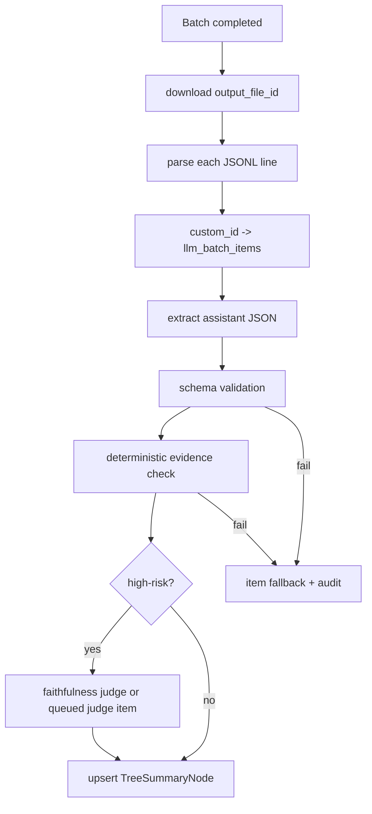

# 记忆树批量推理方案

> 日期：2026-06-18  
> 状态：方案草案  
> 范围：为记忆树构建中的摘要、faithfulness judge 和结论生成增加异步批量模型请求能力。  
> 参考：SiliconFlow [批量推理文档](https://api-docs.siliconflow.cn/docs/userguide/guides/batch)。

## 背景

当前 `sealBuffer` 以单个 tree buffer 为单位调用 `LlmClient.extractStructured` 生成 `SealSummaryOutput`，失败时降级为 extractive summary。这条路径简单可靠，但在构建 source/topic/global 三级记忆树时会产生大量小请求：

- source tree 会随文件、会话或导入源滚动 seal。
- topic tree 会把同一主题下的多批 leaf 聚合为更高层摘要。
- global digest 会对跨主题结果继续折叠。
- P2 起的 high-risk faithfulness judge 会额外消耗推理请求。

这些任务大多不阻塞当次交互，天然适合进入异步批量推理。批量推理可以把大量独立 chat completion 请求写入 JSONL 文件，上传后创建 batch 任务，完成后再按 `custom_id` 合并结果。以 SiliconFlow 当前文档为例，其 batch 流程包含 JSONL 输入、文件上传、创建 batch、轮询状态、读取 output/error 文件，且需要处理完成、失败、过期和取消等状态。

## 设计结论

新增一条 `Batch LLM Lane`，只服务后台高成本加工，不替代当前同步 `LlmClient` 热路径。

```text
fast path:
  store / ingest -> candidate / embedding -> recall 可用

batch lane:
  tree buffers / judge tasks -> batch task planner -> provider batch api
    -> result ingestor -> schema + evidence validation -> TreeSummaryNode / audit
```

核心原则：

1. `LlmClient` 继续负责交互式、低延迟和单次重试场景。
2. `BatchLlmClient` 只负责可延迟任务，默认不阻塞召回。
3. 批量结果必须重新经过结构化 schema 校验、evidence check 和现有 faithfulness 规则。
4. 模型输出只能生成候选结论，不可直接覆盖 leaf 事实；summary 与 leaf 冲突时以 leaf/evidence 为准。
5. 任一 batch item 失败不导致整批回滚；失败项按原降级目标处理。

## 适用任务

首期只接入记忆树相关任务：

| 任务 | 批量化价值 | 输出 | 降级 |
|------|------------|------|------|
| `tree_summary` | source/topic/global seal 量大、可延迟 | `SealSummaryOutput` | extractive summary |
| `summary_faithfulness` | high-risk judge 可集中执行 | `FaithfulnessJudgeOutput` | 按 `summaryFaithfulness.failAction` |
| `tree_conclusion` | 对同一主题/项目生成可读结论 | `TreeConclusionOutput` | 保留 summary，不生成结论 |

暂不纳入首期：

- 候选记忆提取：用户保存链路更靠近热路径，失败后已有 heuristic fallback。
- 语义去重 judge：通常是小流量边界判断，延迟过高会影响入库治理。
- graph extraction：可以复用同一批量框架，但先等 tree summary lane 稳定。

## 架构组件

### Batch Task Planner

扫描待处理 buffer 和 judge 任务，按以下维度分组：

- `provider`、`baseURL`、`endpoint`
- `modelType` 与最终模型名
- `schemaName` 与输出 schema 版本
- `taskKind`
- token 预算与 provider 限制

每个 item 都生成稳定的 `idempotencyKey`：

```text
sha256(taskKind + bufferId + bufferVersion + model + schemaVersion + promptHash)
```

重复规划时若已有相同 key 处于 `submitted`、`running`、`completed`，直接跳过，避免重复付费。

### BatchLlmProvider

新增 provider 抽象，避免把 SiliconFlow 细节写死进 tree 模块：

```typescript
interface BatchLlmProvider {
  readonly name: string;
  readonly endpoint: "/v1/chat/completions";
  createBatch(input: CreateBatchInput): Promise<BatchHandle>;
  getBatch(batchId: string): Promise<BatchStatus>;
  cancelBatch(batchId: string): Promise<void>;
  downloadResults(fileId: string): Promise<AsyncIterable<BatchResultLine>>;
}
```

SiliconFlow 适配器采用 OpenAI-compatible batch 形态：

- 每行 JSONL 包含 `custom_id`、`method`、`url`、`body`。
- `url` 使用 `/v1/chat/completions`。
- 文件上传使用 `purpose=batch`。
- 创建 batch 时提交 `input_file_id`、`endpoint`、`completion_window` 和可选 `metadata`。
- 轮询 batch 状态后，通过 `output_file_id` 读取成功结果，通过 `error_file_id` 读取失败结果。

Provider 限制不写死在业务逻辑中，而是落在 adapter capability：

```typescript
interface BatchProviderCapability {
  maxLinesPerFile: number;
  maxBytesPerFile: number;
  supportedCompletionWindows: string[];
  resultRetentionHours?: number;
}
```

SiliconFlow 当前文档提到单批行数和文件大小上限；实现默认使用安全余量，例如 `maxLinesPerFile=4500`、`maxBytesPerFile=900MiB`，真实值由 adapter 配置覆盖。

### Batch Job Repository

需要持久化 batch 状态，防止进程重启后丢任务。

建议新增两张逻辑表：

```sql
llm_batch_jobs(
  id,
  provider,
  endpoint,
  model,
  task_kind,
  status,
  input_file_id,
  provider_batch_id,
  output_file_id,
  error_file_id,
  request_counts,
  metadata,
  created_at,
  submitted_at,
  completed_at,
  expires_at
)

llm_batch_items(
  id,
  job_id,
  custom_id,
  idempotency_key,
  task_kind,
  target_type,
  target_id,
  prompt_hash,
  schema_name,
  status,
  result,
  error,
  created_at,
  completed_at
)
```

`custom_id` 格式建议：

```text
ms:{jobId}:{itemId}
```

业务映射不要只依赖 `custom_id` 字符串解析，必须以 `llm_batch_items.custom_id` 查询落库记录，避免 provider 回传顺序变化或部分缺失导致错配。

## 批量请求格式

每个 tree summary item 序列化为一行 JSONL：

```json
{
  "custom_id": "ms:job_20260618:item_0001",
  "method": "POST",
  "url": "/v1/chat/completions",
  "body": {
    "model": "summarization-model",
    "messages": [
      { "role": "system", "content": "你是 mengshu 记忆树摘要器..." },
      { "role": "user", "content": "treeType: source\n..." }
    ],
    "temperature": 0,
    "response_format": { "type": "json_object" }
  }
}
```

约束：

- system message 只放稳定规则，动态 leaves 只放 user message，对齐 D-08。
- temperature 恒为 `0.0`，对齐 D-18。
- `body.model` 来自 `llm.summarizationModel` 或 `llm.reasoningModel`。
- 每个 item 的输入 leaves 与 `sealBuffer` 保持同一 schema，最多 30 条 leaf。
- JSONL 文件落盘前必须经过与 agent history 相同的 redaction 策略。

## 结果合并流程



结果合并必须是幂等的：

- `TreeSummaryNode.id` 仍由 scope、treeType、treeKey、level、sealedAt 生成。
- 同一 `idempotencyKey` 已完成时不重复写 summary。
- 成功写入 summary 后再删除/归档原 buffer。
- provider 的错误文件按 item 记录，不影响同批成功 item。

## 结论生成

`tree_summary` 只负责压缩 evidence；`tree_conclusion` 面向人和 agent 生成更高层可读结论，但仍不能创造新事实。

建议输出 schema：

```typescript
interface TreeConclusionOutput {
  title: string;
  conclusion: string;
  confidence: "low" | "medium" | "high";
  supportingSummaryIds: string[];
  supportingLeafIds: string[];
  decisions: Array<{
    text: string;
    evidenceIds: string[];
  }>;
  risks: Array<{
    text: string;
    evidenceIds: string[];
  }>;
  openQuestions: string[];
}
```

结论可用于：

- `ms why` 展示某个 topic/global digest 的来源。
- Web Console 展示项目状态、规则变化、资源索引。
- `status_summary` intent 的可读补充。

结论不可用于：

- 覆盖原始 leaf。
- 直接晋升为 `rules` 或 `profile`。
- 自动扩大 scope。

## 配置草案

```json
{
  "memory": {
    "tree": {
      "batchInference": {
        "enabled": false,
        "provider": "siliconflow",
        "taskKinds": ["tree_summary", "summary_faithfulness", "tree_conclusion"],
        "minItemsPerBatch": 20,
        "maxItemsPerBatch": 4500,
        "maxBytesPerBatch": 943718400,
        "completionWindow": "24h",
        "pollIntervalSeconds": 60,
        "maxResultIngestItems": 500,
        "fallbackOnExpired": true
      }
    }
  },
  "llm": {
    "batch": {
      "siliconflow": {
        "baseURL": "https://api.siliconflow.cn/v1",
        "apiKey": "${SILICONFLOW_API_KEY}",
        "summarizationModel": "deepseek-ai/DeepSeek-V3.2",
        "reasoningModel": "deepseek-ai/DeepSeek-V3.2"
      }
    }
  }
}
```

默认关闭，只有用户明确启用并配置 provider 后才会上传 leaf 文本到第三方模型服务。

## 安全与隐私

1. 若记忆包含 `riskFlags.sensitive`，默认不进入远端 batch；除非配置显式允许并通过 scope 策略。
2. 命中 prompt injection 的 evidence-only 输入不得参与 tree summary batch。
3. JSONL 临时文件写入 `~/.mengshu/cache/batches`，完成或过期后按 TTL 清理。
4. 日志只记录 `custom_id`、hash、token 估算和状态，不打印完整 prompt。
5. `ms doctor` 增加 batch provider 连通性检查，但不发送真实记忆内容。

## 失败处理

| 失败点 | 处理 |
|--------|------|
| JSONL 生成失败 | 不提交 batch，任务保持 `planned_failed`，写 audit |
| 文件上传失败 | 指数退避重试，超过次数后回到同步/extractive 降级 |
| batch `failed` | 全批标记失败，所有 item 进入降级 |
| batch `expired` | 已完成 item 正常合并，未完成 item 降级或重新排队 |
| 单 item schema 失败 | 仅该 item 降级，记录原始错误摘要 |
| evidence check 失败 | 不写 summary，按 `fallback_extractive` 或 `mark_untrusted` |
| 结果文件过期/丢失 | 使用本地 job 记录恢复为降级状态，不反复轮询 |

## 观测与命令

建议新增 CLI：

```bash
ms batch list
ms batch status <jobId>
ms batch cancel <jobId>
ms batch retry <jobId> --failed-only
ms cost --batch
```

关键指标：

- `llm_batch_jobs_total{provider,status,taskKind}`
- `llm_batch_items_total{status,taskKind}`
- `llm_batch_item_latency_seconds`
- `llm_batch_schema_fail_total`
- `llm_batch_evidence_fail_total`
- `llm_batch_fallback_total`
- `llm_batch_estimated_cost`

## 实施阶段

### Phase 1：基础设施

- 增加 `BatchLlmProvider`、SiliconFlow adapter、JSONL serializer/parser。
- 增加 job/item repository 和 in-memory fake provider 测试。
- CLI 只支持 `list/status/cancel`。

验收：fake provider 能完整跑通 submit、poll、download、ingest；异常 item 不影响成功 item。

### Phase 2：tree summary 接入

- Planner 扫描可延迟 `TreeBuffer`。
- `sealBuffer` 保持同步行为，新建 `sealBufferBatchItem` 复用同一 prompt/schema。
- batch 成功后写入 `TreeSummaryNode`。

验收：`mengshu-tree-summary` golden set 通过；batch 与同步路径对同一输入产出结构等价。

### Phase 3：faithfulness 与结论

- high-risk faithfulness judge 支持批量。
- 新增 `tree_conclusion` 输出并接入 Console / `ms why` 展示。
- `ms cost --batch` 展示 token 与金额估算，对齐 D-22。

验收：summary faithfulness >= 0.95，keyFact evidence rate = 1.0，结论所有 claim 可回溯。

### Phase 4：多 provider

- 抽象 provider capability。
- 支持 OpenAI-compatible Batch 或其他供应商 Batch API。
- 对 provider 限制、保留期、状态枚举做 contract test。

## 测试计划

- 单元测试：JSONL serializer、`custom_id` 映射、schema 校验、状态机转换。
- 集成测试：fake provider 模拟 completed、failed、expired、partial success。
- 回归测试：`npx vitest run packages/core/src/tree tests/eval`。
- 评测：全量 `npm run eval:quick`，重点关注 `mengshu-tree-summary`。
- 安全测试：敏感 leaf、prompt injection leaf、provider 结果乱序、重复结果。

## 待确认问题

1. 是否把 batch job 表纳入正式 schema migration，还是先用 repository metadata 存储。
2. SiliconFlow 之外首批要支持哪些 provider；不同 provider 的结果保留期和状态枚举需要实测。
3. `tree_conclusion` 是否作为独立 summary node，还是作为 `TreeSummaryNode.metadata.conclusion`。
4. 开启 batch 后，低频用户是否默认等 `minItemsPerBatch`，还是到 `sealStaleHours` 后允许小批量提交。
