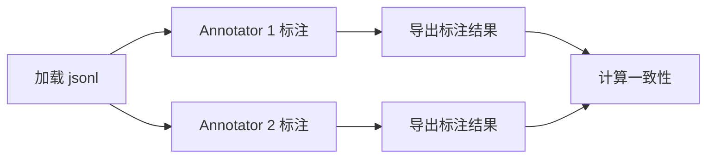

# Golden Set 标注指南

> **版本**：v1.0
> **更新时间**：2026-06-17
> **适用范围**：mengshu eval golden set 人工标注

---

## 一、标注目标

将经验值 golden set 转换为经过人工验证的评测集，确保：

1. **提取标注**：type、targetScope、evidence span 三要素完整且准确
2. **去重标注**：duplicate/update/conflict/related/distinct 关系判定一致
3. **边界样例**：应抽不抽/不应抽却抽/近义边界等 case 经严格审核

---

## 二、标注规范

### 2.1 mengshu-extraction 标注

#### 2.1.1 三要素检查

每条 case 必须验证：

1. **type（语义类型）**：
   - `profile`：跨情境稳定的用户偏好/习惯/风险边界
   - `rules`：强约束规则（必须/禁止/总是/从不）
   - `experience`：具体情境的经验/教训（含 why）
   - `task_context`：任务目标/里程碑/阻塞项（绑定项目/会话）
   - `resource`：工具/文档/API/命令（含用途）

2. **targetScope（目标范围）**：
   - `session`：仅限当前会话
   - `project`：项目级
   - `workspace`：工作空间级
   - `app`：应用级
   - `user`：用户级
   - `global`：全局

3. **evidence（证据片段）**：
   - 必须能在 `input.conversation` 中找到
   - 不能是 LLM 幻觉或推断
   - 长度适中（不要整段复制）

#### 2.1.2 type 判定准则

| type | 必要条件 | 充分条件 | 反例 |
|------|----------|----------|------|
| profile | 跨情境稳定性 | 含"一般""通常""默认""总是"等词 | 单次情境偏好 |
| rules | 强约束词 | 含"必须""禁止""总是""从不""never" | 建议词（"可以""建议"） |
| experience | 具体情境 + 结果/原因 | 含"因为""导致""教训""上次" | 纯结果无 why |
| task_context | 绑定项目/会话 | 含"本周""当前任务""这次" | 跨项目通用规则 |
| resource | 资源名 + 用途 | 含文件路径/URL/命令/工具名 | 仅提及无用途 |

#### 2.1.3 targetScope 判定准则

| scope | 触发条件 | 示例 |
|-------|----------|------|
| session | 含"这次""当前""刚才" | "这次任务用 monorepo" |
| project | 含"项目""本项目" 或 `projectId` 存在 | "项目用 React" |
| workspace | 含"工作空间""团队" | "团队编码规范" |
| app | 含"OpenClaw 里""在 XX 应用" | "OpenClaw 里复杂任务先看代码" |
| user | 含"我一般""我偏好""默认" | "我偏好简洁回答" |
| global | 含"所有项目""任何时候" | "所有项目交流默认中文" |

**收窄原则**（闸门 11）：
- LLM 给出的 scope 不能超过当前上下文 scope
- 例如：当前无 `projectId` 时，LLM 给 `project` scope → 收窄为 `session`

#### 2.1.4 evidence 提取规范

✅ **正确示例**：
```json
{
  "input": {"conversation": [{"role": "user", "text": "我一般喜欢先看到结论再看详细计划"}]},
  "expected": {
    "candidates": [{
      "type": "profile",
      "body": "用户偏好先结论后细节",
      "evidence": "我一般喜欢先看到结论再看详细计划"
    }]
  }
}
```

❌ **错误示例**（LLM 幻觉）：
```json
{
  "input": {"conversation": [{"role": "user", "text": "用 React 开发"}]},
  "expected": {
    "candidates": [{
      "evidence": "用 React 18 开发"  // ❌ 源文本没有 "18"
    }]
  }
}
```

#### 2.1.5 边界样例判定

**应抽不抽**（over-capture 漏报）：
- ext-066：LLM 忽略明显 rules（"永远不要用 eval"）
- ext-070：隐式偏好（"每次都先测试再提交"）

**不应抽却抽**（over-capture 误报）：
- ext-067：日常对话（"天气真好"）
- ext-068：纯疑问（"什么是 TypeScript?"）
- ext-069：常识陈述（"React 用虚拟 DOM"）

**判定原则**：
1. 日常寒暄/常识 → 不抽
2. 纯疑问/查询 → 不抽
3. 含偏好/规则/经验 → 抽
4. 疑惑时：问"这条信息未来有复用价值吗？"

---

### 2.2 mengshu-dedup 标注

#### 2.2.1 关系枚举定义

| relation | 定义 | 示例 A | 示例 B |
|----------|------|--------|--------|
| duplicate | 语义完全相同或同义表达 | "交流用中文" | "用中文交流" |
| update | B 是 A 的增量/细化/升级 | "用 React" | "用 React 18 + TypeScript" |
| conflict | A 与 B 互斥冲突 | "总是用单引号" | "总是用双引号" |
| related | 主题相关但不重复 | "用 ESLint" | "用 Prettier" |
| distinct | 完全无关 | "用户偏好简洁" | "API 文档在 docs/" |

#### 2.2.2 duplicate 判定准则

**必要条件**：语义等价

**充分条件**（满足任一）：
1. 完全相同（hash 去重）
2. lexical similarity >= 0.88（中文短文本）或 >= 0.85（英文）
3. 同义表达（"交流用中文" vs "用中文交流"）
4. 缩写展开（"用 TS" vs "用 TypeScript"）
5. 冗余词差异（"项目用 React" vs "本项目使用 React 框架"）

**反例**：
- dd-031：❌ "用 React" vs "用 React 18 + TypeScript" → update（B 更具体）
- dd-061：❌ "用 React 18" vs "用 React Router v6" → related（都是 React 生态但不重复）

#### 2.2.3 update 判定准则

**必要条件**：B 包含 A 的全部信息 + 新增信息

**充分条件**（满足任一）：
1. 增加细节（dd-031："用 React" → "用 React 18 + TypeScript"）
2. 增加约束（dd-032："写测试" → "提交前必须写测试"）
3. 范围扩大（dd-033："登录页用 TypeScript" → "所有页面用 TypeScript"）
4. 版本升级（dd-034："用 Node 16" → "用 Node 18"）
5. 添加原因（dd-035："用 Vite" → "用 Vite 因为启动快"）

**反例**：
- ❌ "用 React" vs "用 Vue" → conflict（工具替换非 update）
- ❌ "建议用 ESLint" vs "必须用 ESLint" → update（从建议到强制）

#### 2.2.4 conflict 判定准则

**必要条件**：A 与 B 互斥，不能同时为真

**充分条件**（满足任一）：
1. 规则互斥（dd-041："总是用单引号" vs "总是用双引号"）
2. 工具互斥（dd-043："用 npm" vs "用 pnpm"）
3. 策略相反（dd-044："优先性能" vs "优先可读性"）

**特殊规则**：
- rules 类冲突 **false merge 必须为 0**（release gate）
- profile/resource 类冲突可标记 `autoResolve=false`

**反例**：
- ❌ "用 ESLint" vs "用 Prettier" → related（互补非互斥）
- ❌ "用 React 18" vs "用 React Router v6" → related（同生态不同模块）

#### 2.2.5 related 判定准则

**必要条件**：主题相关但不重复

**示例**：
- dd-061："用 React 18" vs "用 React Router v6"（同生态）
- dd-062："用 ESLint" vs "用 Prettier"（同领域不同工具）
- dd-063："函数名用 camelCase" vs "类名用 PascalCase"（同规范不同对象）

**边界 case**：
- dd-069：高 lexical 但不 duplicate（"用 Node.js 后端" vs "用 Node.js 脚本"）
- dd-070：近义高但语义不同（"优先完成登录" vs "优先保证质量"）

#### 2.2.6 distinct 判定准则

**必要条件**：完全无关

**示例**：
- dd-076：不同类型（profile vs resource）
- dd-077：不同项目（projectId 不同）
- dd-078：完全不同主题（"Vite 启动快" vs "数据库用 PostgreSQL"）

---

### 2.3 近义边界样例标记

从 80 条 dedup case 中挑选 **15 条近义边界样例**，需要：

1. **双人独立标注**（不讨论）
2. **标记 `boundary_case: true`**
3. **记录 lexical_similarity 分数**
4. **分歧进仲裁**

**近义边界样例列表**：
- dd-002, dd-008：中文近义词
- dd-006, dd-010：冗余词汇
- dd-022, dd-030：否定等价
- dd-031~033：update 边界
- dd-035, dd-040：从建议到规则
- dd-069~070：高 lexical 但不 duplicate

---

## 三、标注流程

### 3.1 双人独立标注



**步骤**：
1. 两位标注人各自加载同一 jsonl 文件
2. 独立标注，不讨论
3. 导出各自的标注结果（带标注人 ID）
4. 运行一致性计算工具

### 3.2 一致性计算

使用 **Cohen's Kappa** 计算一致性：

```
Kappa = (P_o - P_e) / (1 - P_e)

P_o = 观察到的一致比例
P_e = 随机一致比例
```

**门禁**：
- Kappa >= 0.85：直接合并
- 0.70 <= Kappa < 0.85：审核分歧样例，仲裁后合并
- Kappa < 0.70：重新标注（标注规范可能不清晰）

### 3.3 仲裁流程

对于标注分歧样例：

1. **展示分歧**：
   - Case ID
   - Annotator 1 标注
   - Annotator 2 标注
   - 原始数据

2. **仲裁人判定**：
   - 选择 A1 / A2 / 新标注
   - 记录仲裁原因

3. **更新结果**：
   - 写入 `annotation.arbitrator`
   - 写入 `annotation.final_label`
   - 写入 `annotation.arbitration_reason`

---

## 四、标注元数据格式

### 4.1 extraction 标注元数据

```json
{
  "id": "ext-001",
  "suite": "mengshu-extraction",
  "task": "...",
  "scope": {...},
  "input": {...},
  "expected": {...},
  "annotation": {
    "annotator": "human_001",
    "annotatedAt": "2026-06-17T10:30:00Z",
    "reviewedBy": "human_002",
    "reviewedAt": "2026-06-17T14:00:00Z",
    "agreement": "full",
    "boundaryCase": false,
    "notes": "evidence span 已人工核对"
  }
}
```

### 4.2 dedup 标注元数据（双人标注）

```json
{
  "id": "dd-002",
  "suite": "mengshu-dedup",
  "task": "...",
  "memoryA": {...},
  "memoryB": {...},
  "expected": {"relation": "duplicate"},
  "annotation": {
    "annotator_1": "human_001",
    "annotator_1_label": "duplicate",
    "annotator_2": "human_002",
    "annotator_2_label": "duplicate",
    "agreement": "full",
    "boundaryCase": true,
    "lexicalSimilarity": 0.89,
    "annotatedAt": "2026-06-17T10:30:00Z",
    "notes": "中文近义词，0.88 阈值边界"
  }
}
```

### 4.3 dedup 标注元数据（有仲裁）

```json
{
  "id": "dd-035",
  "annotation": {
    "annotator_1": "human_001",
    "annotator_1_label": "update",
    "annotator_2": "human_002",
    "annotator_2_label": "related",
    "agreement": "conflict",
    "arbitrator": "human_003",
    "finalLabel": "update",
    "arbitrationReason": "B 增加了 why（因为启动快），属于增量信息，判定为 update",
    "annotatedAt": "2026-06-17T10:30:00Z",
    "arbitratedAt": "2026-06-17T16:00:00Z"
  }
}
```

---

## 五、质量检查清单

### 5.1 提交前检查（每条 case）

- [ ] 三要素完整（type/targetScope/evidence）
- [ ] evidence 可在源文本找到
- [ ] targetScope 不超界（符合闸门 11）
- [ ] 标注元数据完整
- [ ] 边界样例已标记 `boundaryCase: true`

### 5.2 批量检查（整个 suite）

- [ ] 一致性 >= 0.85（dedup 套件）
- [ ] 边界样例第三人审核通过
- [ ] rules 冲突样例 false merge=0
- [ ] manifest sha256 已更新

---

## 六、常见问题

### Q1：type 判定不确定怎么办？

**A**：按决策树：
1. 有强约束词（必须/禁止/总是/从不）→ rules
2. 含跨情境稳定性词（一般/默认/通常）→ profile
3. 含具体情境+结果/原因 → experience
4. 绑定任务/项目 → task_context
5. 含资源名+用途 → resource

### Q2：duplicate vs related 边界如何判定？

**A**：核心问题："B 是否重复表达了 A 的核心信息？"
- 是 → duplicate
- 否，但主题相关 → related

**示例**：
- "用 React 18" vs "用 React Router v6" → related（React 18 是框架版本，Router 是路由库，核心信息不同）
- "交流用中文" vs "用中文交流" → duplicate（核心信息相同）

### Q3：update vs related 边界如何判定？

**A**：核心问题："B 是否包含 A 的全部信息？"
- 是，且有新增信息 → update
- 否，两者是独立信息 → related

**示例**：
- "用 React" → "用 React 18 + TypeScript" → update（B 包含 A + 版本 + TS）
- "用 React 18" vs "用 React Router v6" → related（B 不包含 A 的信息）

### Q4：evidence 长度如何控制？

**A**：
- **最短**：能唯一定位到源文本的最小片段
- **最长**：不超过一句话（50 字符）
- **示例**：
  - 源文本："我一般喜欢先看到结论再看详细计划，不要寒暄"
  - evidence："我一般喜欢先看到结论再看详细计划" ✅
  - evidence："我一般喜欢先看到结论再看详细计划，不要寒暄" ✅
  - evidence："我一般喜欢" ❌（不完整）

### Q5：分歧样例仲裁时的原则？

**A**：
1. **优先信任标注规范**：按本指南定义判定
2. **边界样例从严**：疑惑时选更保守的标注
3. **记录仲裁理由**：便于后续回溯

---

## 七、参考文档

- `eval/EXPANSION_PLAN.md`：扩充计划
- `eval/README.md`：评测基础设施
- 设计 §15.5：标注策略
- 设计 §2.3：MemorySemanticType 定义
- 设计 §5.4：去重关系枚举

---

**记住**：标注质量直接决定评测集可信度，疑惑时务必查阅标注规范或咨询仲裁人。
