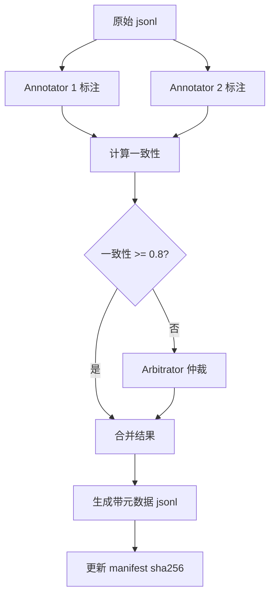

# Golden Set 扩充计划：从经验值到验证值

> **目标**：按设计 §15.5 标注策略，将现有经验值 golden set 扩充为经过人工标注验证的评测集
> **负责人**：待分配
> **截止时间**：P0-c 阶段
> **状态**：规划中

---

## 一、当前状态分析

### 1.1 已有 Golden Set 规模

| Suite | 当前条数 | 目标条数 | 状态 | 备注 |
|-------|---------|---------|------|------|
| mengshu-extraction | 100+ | 100 | ✓ 达标 | 需增加标注元数据 |
| mengshu-dedup | 80 | 80 | ✓ 达标 | 需双人标注+仲裁 |
| mengshu-recall-explain | 60 | 60 | ✓ 达标 | 需 breakdown 验证 |
| mengshu-conflict | 10 | 50 (P1/P3) | ⚠️ 不足 | P0 阶段 10 条骨架足够 |
| mengshu-tree-summary | 8 | 50 (P3) | ⚠️ 不足 | P0 阶段 8 条骨架足够 |
| mengshu-skill-candidate | 8 | 30 (P4) | ⚠️ 不足 | P0 阶段 8 条骨架足够 |

### 1.2 问题诊断

当前 golden set 存在以下问题：

1. **缺少标注元数据**：
   - 无标注人信息（annotator、reviewer）
   - 无标注时间戳（annotatedAt）
   - 无双人标注一致性标记（agreement）

2. **缺少验证流程**：
   - dedup 近义边界样例未标记"需双人标注"
   - extraction 的 evidence span 未经人工校验
   - 无仲裁记录（对于分歧样例）

3. **缺少边界 case 覆盖**：
   - extraction 缺少更多"应抽不抽"/"不应抽却抽"边界样例
   - dedup 缺少中文短文本阈值 0.88 临界样例
   - conflict 的 rules false merge 边界样例不足

---

## 二、扩充策略（按 §15.5）

### 2.1 P0 阶段（提取 + 去重）

#### 2.1.1 mengshu-extraction（100 条）

**标注要求**：
- ✅ 已有：type、targetScope、evidence（从 conversation 提取）
- ❌ 缺失：标注元数据

**扩充方案**：

1. **增加标注元数据字段**（每条 case 增加）：
```json
{
  "id": "ext-001",
  "annotation": {
    "annotator": "human_001",
    "annotatedAt": "2026-06-17",
    "reviewedBy": "human_002",
    "reviewedAt": "2026-06-18",
    "agreement": "full",
    "notes": "evidence span 已人工核对"
  }
}
```

2. **重点补充边界样例**（从现有 100 条中挑选 20 条）：
   - ext-066~070：应抽不抽/不应抽却抽（5 条）
   - ext-015~018：拒绝闸门测试（4 条）
   - ext-087~090：敏感信息拦截（4 条）
   - ext-091~094：type 边界（4 条）
   - ext-098~100：evidence 引用（3 条）

3. **人工验证流程**：
   - 双人独立标注 → 计算一致性（Cohen's Kappa）
   - 分歧样例进仲裁 → 记录仲裁结论
   - 边界样例额外审核 → 确保 type/targetScope/evidence 三者完整

#### 2.1.2 mengshu-dedup（80 条）

**标注要求**：
- ✅ 已有：relation（duplicate/update/conflict/related/distinct）
- ❌ 缺失：近义边界标记、双人标注记录

**扩充方案**：

1. **标记近义边界样例**（从现有 80 条中挑选 15 条）：
   - dd-002, dd-008：中文近义词（"交流用中文" vs "用中文交流"）
   - dd-006, dd-010：冗余词汇（"项目用 React" vs "本项目使用 React 框架"）
   - dd-022, dd-030：否定等价（"不要用 var" vs "禁止用 var"）
   - dd-031~040：update 边界（增加细节 vs 不同记忆）
   - dd-069~070：高 lexical 但不 duplicate（验证 0.88 阈值）

2. **增加标注元数据**：
```json
{
  "id": "dd-002",
  "annotation": {
    "annotator_1": "human_001",
    "annotator_2": "human_002",
    "agreement": "full",
    "boundary_case": true,
    "lexical_similarity": 0.89,
    "annotatedAt": "2026-06-17",
    "notes": "中文近义词，0.88 阈值边界"
  }
}
```

3. **仲裁记录**（对于分歧样例）：
```json
{
  "id": "dd-035",
  "annotation": {
    "annotator_1": "human_001",
    "annotator_1_label": "update",
    "annotator_2": "human_002",
    "annotator_2_label": "related",
    "arbitrator": "human_003",
    "final_label": "update",
    "arbitration_reason": "B 增加了 why（因为启动快），属于增量信息，判定为 update"
  }
}
```

4. **人工验证流程**：
   - 80 条全部双人独立标注
   - 近义边界样例（15 条）第三人额外审核
   - rules 类冲突样例（dd-041~060）严格校验（false merge=0）

#### 2.1.3 mengshu-recall-explain（60 条）

**标注要求**：
- ✅ 已有：profile/rules/experience/task_context/resource 各 10 条
- ❌ 缺失：breakdown 输出率验证

**扩充方案**：

1. **增加 breakdown 校验字段**：
```json
{
  "id": "rec-001",
  "expected": {
    "breakdownFields": ["importance", "salience", "recency", "queryRelevance"],
    "allFieldsPresent": true,
    "traceableToSource": true
  },
  "annotation": {
    "annotator": "human_001",
    "breakdownVerified": true,
    "annotatedAt": "2026-06-17"
  }
}
```

2. **人工验证流程**：
   - 每条 case 验证 importance 4 项明细（salience/recency/queryRelevance/userFeedback）
   - 验证 filtered reason 可追溯到具体规则
   - 确保 breakdown 输出率=1.0

---

### 2.2 P1 阶段（摘要 + 冲突）

#### 2.2.1 mengshu-tree-summary（目标 50 条）

**当前**：8 条骨架
**P1 扩充**：42 条

**标注要求**（§15.5）：
- 摘要 key fact 须逐条挂 evidence id
- 无法溯源的事实标为"待删除"（faithfulness 反例）

**扩充方案**：

1. **source tree 摘要**（15 条）：
   - 单文件摘要（5 条）
   - 多文件归并摘要（5 条）
   - 层级摘要（L0→L1→L2，5 条）

2. **topic tree 摘要**（15 条）：
   - 单 topic 摘要（5 条）
   - 跨 topic 关联摘要（5 条）
   - topic alias 归一化（5 条）

3. **global tree 摘要**（12 条）：
   - 全局 profile 摘要（4 条）
   - 全局 rules 摘要（4 条）
   - 全局 experience 摘要（4 条）

4. **faithfulness 反例**（8 条）：
   - 幻觉事实（无 evidence，4 条）
   - 推断事实（超出 evidence 范围，4 条）

5. **标注格式**：
```json
{
  "id": "tree-001",
  "treeType": "source",
  "leafIds": ["m1", "m2", "m3"],
  "expected": {
    "summary": "用户偏好 TDD，先写测试再实现",
    "keyFacts": [
      {
        "fact": "用户偏好 TDD",
        "evidenceIds": ["m1", "m2"],
        "faithful": true
      },
      {
        "fact": "先写测试再实现",
        "evidenceIds": ["m3"],
        "faithful": true
      }
    ],
    "faithfulness": 1.0,
    "keyFactEvidenceRate": 1.0
  },
  "annotation": {
    "annotator": "human_001",
    "reviewedBy": "human_002",
    "evidenceVerified": true,
    "annotatedAt": "2026-06-17"
  }
}
```

#### 2.2.2 mengshu-conflict（目标 50 条，P1/P3 分阶段）

**当前**：10 条骨架（dd-041~060 中的 rules 类冲突）
**P1 扩充**：20 条（重点 rules 类）
**P3 扩充**：20 条（profile/resource/experience 类）

**扩充方案**：

1. **rules 强冲突**（P1，20 条）：
   - 编码规范冲突（引号、分号、缩进、命名，8 条）
   - 工具选择冲突（包管理器、构建工具、测试框架，6 条）
   - 安全策略冲突（日志级别、缓存策略、错误处理，6 条）

2. **profile 冲突**（P3，10 条）：
   - 优先级冲突（性能 vs 可读性，3 条）
   - 提交习惯冲突（小步 vs 大步，3 条）
   - 计划偏好冲突（先计划 vs 直接实现，4 条）

3. **resource 冲突**（P3，10 条）：
   - 框架选择（React vs Vue，3 条）
   - API 风格（REST vs GraphQL，3 条）
   - 状态管理（Redux vs Zustand，4 条）

4. **标注格式**：
```json
{
  "id": "conflict-001",
  "memoryA": {"body": "总是用单引号", "type": "rules"},
  "memoryB": {"body": "总是用双引号", "type": "rules"},
  "expected": {
    "relation": "conflict",
    "contradicts": true,
    "conflictType": "mutual_exclusive",
    "autoResolve": false
  },
  "annotation": {
    "annotator_1": "human_001",
    "annotator_2": "human_002",
    "agreement": "full",
    "falseMergePotential": "high",
    "annotatedAt": "2026-06-17",
    "notes": "强冲突，false merge=0 gate"
  }
}
```

---

### 2.3 P2 阶段（主动学习采样）

**策略**：
- 从线上低置信度、近阈值、misclassified 样例中采样
- 回灌各 suite，持续扩容
- 优先级：extraction > dedup > recall-explain

**采样来源**：
1. LLM 提取 salience < 0.5 的低置信候选（10 条/周）
2. lexical similarity 0.85~0.90 的近阈值去重（5 条/周）
3. semantic similarity 0.82~0.90 的近阈值去重（5 条/周）
4. user feedback 标记为"不相关"的召回（5 条/周）

---

## 三、标注工具与流程

### 3.1 标注工具需求

构建轻量级标注工具（`eval/tools/annotator.ts`）：

**功能**：
1. 加载 jsonl → 渲染待标注 case
2. 双人标注 UI（支持并行标注）
3. 一致性计算（Cohen's Kappa）
4. 仲裁界面（展示分歧样例）
5. 导出带标注元数据的 jsonl

**技术栈**：
- CLI：Inquirer.js（交互式标注）
- Web UI：Vite + React（可选，P2）

### 3.2 标注流程



### 3.3 标注规范文档

创建 `eval/ANNOTATION_GUIDE.md`：
- extraction 标注规范（type/targetScope/evidence 三要素）
- dedup 关系枚举定义（duplicate/update/conflict/related/distinct）
- 边界 case 判定准则
- 仲裁流程

---

## 四、验收标准

### 4.1 P0-c 验收（提取 + 去重）

- [ ] mengshu-extraction 100 条全部带标注元数据
- [ ] mengshu-dedup 80 条全部双人标注，一致性 >= 0.85
- [ ] 边界样例（extraction 20 条 + dedup 15 条）第三人审核通过
- [ ] rules 冲突样例（dedup 20 条）false merge=0 验证通过
- [ ] mengshu-recall-explain 60 条 breakdown 输出率=1.0

### 4.2 P1 验收（摘要 + 冲突）

- [ ] mengshu-tree-summary 扩充至 50 条
- [ ] 所有摘要 key fact 挂 evidence id，faithfulness >= 0.95
- [ ] mengshu-conflict 扩充至 30 条（20 条 rules + 10 条 profile/resource）
- [ ] rules 冲突 false merge=0 gate 通过

### 4.3 P2 验收（主动学习）

- [ ] 每周采样 25 条新样例
- [ ] 累计扩容至 extraction 150 条、dedup 120 条
- [ ] 建立 misclassified 样例回流机制

---

## 五、资源估算

### 5.1 人力投入

| 阶段 | 标注人 | 审核人 | 仲裁人 | 预计工时 |
|------|--------|--------|--------|----------|
| P0-c | 2 人 | 1 人 | 1 人 | 3-4 天 |
| P1 | 2 人 | 1 人 | 1 人 | 5-6 天 |
| P2 | 1 人（持续） | 1 人（每周） | - | 2 小时/周 |

### 5.2 工具开发

| 工具 | 功能 | 预计工时 |
|------|------|----------|
| eval/tools/annotator.ts | CLI 标注工具 | 1 天 |
| eval/tools/consistency.ts | 一致性计算 | 0.5 天 |
| eval/ANNOTATION_GUIDE.md | 标注规范文档 | 0.5 天 |
| eval/tools/export-with-metadata.ts | 导出带元数据 jsonl | 0.5 天 |

---

## 六、风险与缓解

### 6.1 风险

1. **标注一致性低**（< 0.8）
   - 缓解：增加标注规范细节，标注前培训

2. **边界样例争议大**
   - 缓解：边界样例预先定义判定准则，仲裁人有最终决定权

3. **工期延误**
   - 缓解：P0 阶段优先，P1/P2 可延后

### 6.2 质量保障

1. **双人标注 + 仲裁**：确保标注质量
2. **一致性门禁**：一致性 < 0.8 必须重新标注
3. **边界样例额外审核**：第三人审核通过才入库
4. **持续监控**：P2 主动学习采样，持续改进

---

## 七、执行时间线

```
Week 1-2 (P0-c):
  - 开发标注工具
  - 双人标注 extraction 100 条 + dedup 80 条
  - 仲裁分歧样例
  - 更新 manifest

Week 3-4 (P1):
  - 扩充 tree-summary 至 50 条
  - 扩充 conflict 至 30 条
  - 人工验证 faithfulness

Week 5+ (P2):
  - 建立主动学习管道
  - 每周采样 25 条
  - 持续扩容
```

---

## 八、参考文档

- 设计 §15.5：标注策略
- 设计 §15.3：强制约束（确定性判定与 LLM 信号分离）
- 设计 §15.4：误判样例与回归
- `eval/README.md`：评测基础设施
- `docs/07-test/memory-evaluation-plan.md`：评测计划
